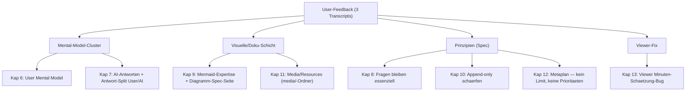
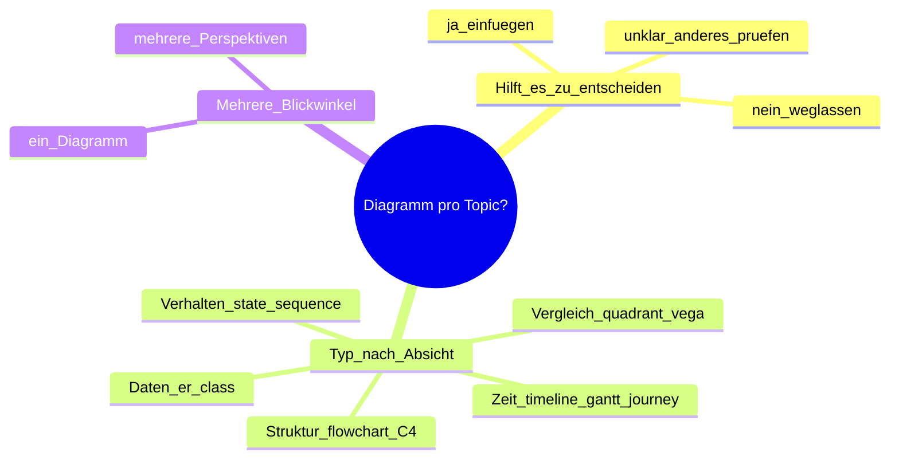

# Plan-F3 Vergleich → Verbesserungs-Plan (IndyDevDan-Inspiration)

| Feld | Wert |
|------|------|
| **Memo** | 038 |
| **Memo-Name** | Plan-F3 Vergleich IndyDevDan Planungsstrategie vs memo-init |
| **Revision** | REV-05 |
| **Datum** | 2026-06-22 18:15 |
| **Status** | Finalisiert |
| **Memo-Typ** | Implementierung |
| **Sekundär-Tag** | Strategie / Research (Vergleichs-Basis als Inspiration) |
| **Typ** | Full |
| **Aenderungen** | **Finalisiert (rollout-ready)** — alle Gates Block A/B/C PASS, 2 WARN akzeptiert; Marker geschrieben |

| Kontaminations-Metadaten | Wert |
|--------------------------|------|
| **Transcript-Input** | Ja |
| **Erstellungs-Kontext** | voll |
| **Session-Phase** | spaet |
| **Session-ID** | `94cebab1-2f1c-4a74-bdc7-a3a7ae72f266` |
| **Initiator** | user |

> **Kontext-Hinweis (Kontamination):** Diese Session ist mittlerweile lang (>400k Tokens, u. a. durch
> Playwright). Erstellungs-Kontext daher **voll**. Alle Bau-Topics sind aber in dieser Session von
> Fresh-Context-Agenten gegen echten Code geerdet (`context/038-implementation-research.md` + der
> Minuten-Bug-Befund) und ein Befund live verifiziert — die handlungsleitenden Aussagen stehen auf
> Datei-Belegen, nicht auf Alt-Wissen. **/clear vor dem Rollout empfohlen.**

---

## Kontext

| Key | Wert |
|-----|------|
| **Projekt** | memo-init (`/Users/andreasbanholzer/WORKBENCH/ressources/projects/memo-init`) |
| **Repos** | `repos/spec` (Prinzipien/Konventionen/Diagramm-Seite), `repos/core` (CLI + Skills + Store), `repos/viewer` (Parser, Antwort-Split, Minuten-Bug, Media) |
| **Betroffene Bereiche** | `.memo/mental-model/`-Store + CLI; questions-Parser (userDecision, answeredBy); Antwort-Split User/AI; Empfehlungs-Hook; Spec `01`/`06`/`07`/`09`/`21`/`34`/`35` + neue Diagramm-Seite; memo-init Mermaid-Tabelle; Viewer Minuten-Schätzung + Media |
| **Referenzmaterial** | IndyDevDan „Plan F3", YouTube `DzbqeO_diOQ` · 3 Feedback-Transcripts + Research + Proof in `context/`/`proofs/` |

---

## 1. IndyDevDans Planungsstrategie destilliert [Docs]

IndyDevDan baut im Video seine Plan-Meta-Skill `/plan-f3` von Grund auf. **Leitsatz:** *„Great planning is great
engineering."* Bausteine: Meta-Skill statt Plan · erst von Hand `raw.md` · „property-based engineering" ·
Trade-off `perf > speed > cost` · Audience-Trifecta · „template your engineering" · HTML-first + KI-Bilder ·
embedded Checklist · per-phase Validation (closed loop) · togglebare Q&A · „run free"-Notes · eine
self-contained Skill mit 5 Workflows · Build-Agent mit frischem Kontext · Plan als **living artifact**.

> **Das eine, was wir lernen:** sein **Framing** (er rahmt Dinge griffig). Inhaltlich gehen wir den eigenen Weg.
> Wir respektieren ihn — er ist in anderen Bereichen weit voraus; **nach außen schreiben wir höflich** (siehe
> Tone-Regel in Kap 10).

---

## 2. Teil 1 — Neutrale Kategorisierung (Vergleichs-Basis) [Docs]

Deterministisch aus `context/038-comparison-data.json` (24 Dim. / 5 Gruppen). Vollständig in REV-01/02; hier
die Gruppen-Essenz (Inspiration + Blog-Material):

| Gruppe | IndyDevDan „Plan F3" | memo-init |
|--------|----------------------|-----------|
| **A Philosophie** | EINE Meta-Skill, raw.md von Hand, template your engineering | memo-sop-Baum + CLI, Transkript-Pipeline, Pflicht-Templates |
| **B Format** | HTML-first + KI-Bilder, living artifact (in-place) | Markdown + Mermaid/Vega, append-only Revisionen |
| **C Fragen** | questionable-Toggle, ZTE | Options-Scoring + questions-json, zwei Touchpunkte, Fragen essenziell |
| **D Ausführung** | Build-Agent fresh, Box+Command | Agent-Team, ternär PASS/BLOCKED/INCONCLUSIVE, Fresh-Context-Grading |
| **E Architektur** | 1 Skill, perf>speed>cost, nur Planen | 86 Skills + CLI, Lifecycle-Layer, eigene Kosten-Haltung (Kap 12) |

---

## 3. Teil 2 — Bewertende Learnings (Vergleichs-Basis) [Docs]

| Kante | Punkte |
|-------|--------|
| **wir voraus** | Fresh-Context-Grading · ternär INCONCLUSIVE · 4-Stage-Ende · Fragen-Interface · Kontaminations-Modell · Mess-Organ (Goals/Maintenance/Chronik/Requirements) |
| **er voraus** | Multimodal (→ wir vertiefen Mermaid, Kap 9) · explizite Kosten-Haltung (→ unsere eigene, Kap 12) |
| **anders/Konvergenz** | append-only vs living-edit (wir richtig, Kap 10) · 1 vs 86 Skills · Audience · Kern-These geteilt |
| **verworfen** | auto Forward-Refs (G3) |

---

## 4. Stance / Meinung — bestätigt [Docs]

- **Konvergenz ist der Hauptbefund** — externe Validierung unserer opinionated Wetten („wir bauen an einem Tag,
  was andere mit Claude Code in 3-4 Tagen bauen").
- **Append-only ist richtig** (Kap 10). „Template your engineering" bestätigt unsere Opinionation.
- Aus dem Vergleich wird dieses **Implementierungs-Memo** — und es wird **bewusst groß**: alles, was aus der
  Diskussion entstand, kommt hinein (Metaplan-Prinzip, Kap 12), nichts wird als „Priorität" weggelassen.

---

## 5. Was wir bauen — Überblick [Diagramme]



---

## 6. User Mental Model — Präferenz-Modell über Memos [Code]

**Idee:** Ein neues Primitiv, das über die Memos hinweg lernt, **wohin der User in Möglichkeitsräumen
tendiert**, indem pro Memo die `## Beantwortete Fragen` ausgewertet werden (AI-Empfehlung vs. tatsächliche
User-Entscheidung). Zusätzlich **extreme Meinungen** flaggen (signalisieren oft, dass das System noch nicht
stimmt — git/env/config). **Name bestätigt:** „User Mental Model" (F4=A).

**Nutzen:** passt die `AI-Empfehlung` künftiger Fragen an — **kein** Ersatz für Fragen (Kap 8), sondern
treffsicherere Empfehlung über die Zeit. Wir müssen es „einfach ausprobieren".

**Architektur (Spiegel Goals/Maintenance, geerdet):** Flat-Store `.memo/mental-model/` + CLI
`memo mental-model derive|show` + **Fresh-Context-Derivations-Skill**, der den Chronik-Walk (N→N-1)
wiederverwendet. **Voraussetzung:** der Parser verwirft heute die `**User:**`-Entscheidung — sie muss zuerst
**maschinenlesbar** werden.

> **Wichtig (User):** AI-Empfehlungen und die **dadurch getroffenen Entscheidungen** müssen **separat angezeigt**
> werden. User-Antworten wiegen ein **Vielfaches** mehr — der User hat das **ultimative Recht**. → Antwort-Split
> (Kap 7).

**PRD-Vorbereitung:**
| PRD | Benötigt aus diesem Kapitel | Benötigt zusätzlich |
|-----|------------------------------|---------------------|
| MentalModelStore + CLI | `.memo/mental-model/`, `memo mental-model derive\|show` | `context/038-implementation-research.md` §B (GoalStore-Template) |
| userDecision maschinenlesbar | Parser fängt `**User:**` + AI-Empfehlung als Paar | §B (`DocumentRegistry.mjs:954-959`) |
| Derivations-Skill (fresh context) | Walk → Tendenz-Achsen + Extrem-Flag | §B (memo-chronic-build-Walk) |
| Empfehlungs-Hook | memo-init/revision-generate liest Mental Model → biast `AI-Empfehlung` | §B (`34:17`) |

---

## 7. AI-beantwortete Fragen + Antwort-Split (User vs AI) [Code]

**Idee:** Bei hoher Konfidenz aus dem Mental Model darf die AI eine Frage **„im Namen des Users"
vor-entscheiden** — aber jede solche Entscheidung muss **gesondert dargelegt und im Memo festgeschrieben**
werden. Bestätigtes Design: question-level Feld **`answeredBy: 'user' | 'ai-on-behalf'`** (Default `user`),
modelliert nach dem memo-Ebenen-`Initiator` — **kein** option-`kind`; Parser liest das Feld; Viewer rendert ein
prominentes Provenance-Badge.

**⛔ Harte Schranke:** eine `ai-on-behalf`-Antwort **zählt NIE automatisch als beantwortet** und öffnet **nie
still** das Finalize-Gate (F5=A) — sie spiegelt „a suggestion never flips the status on its own" (`31:29`) + C7.

**NEU — Antwort-Split (User-Vorgabe, kritisch):** Die Section `## Beantwortete Fragen` wird **getrennt** in
**„Vom User beantwortet"** und **„Von der AI im Namen des Users beantwortet"**. *„Ohne das zerstören wir unser
eigenes System."* Das ist eine **Memo-Struktur-Änderung** (Spec `07`/`34` + memo-init-Template + Viewer-Render)
— in DIESEM Memo bereits dogfood-umgesetzt (siehe unten).

**Schwelle:** **hoch ansetzen (≥95 %) und über die Zeit herunterarbeiten**. Erste Rollout-Stufe **minimal**
(„wir gehen minimal rein, kann man ausbauen").

**PRD-Vorbereitung:**
| PRD | Benötigt aus diesem Kapitel | Benötigt zusätzlich |
|-----|------------------------------|---------------------|
| answeredBy-Schema + Parser + Badge | Feld + Confidence-Quelle (Mental Model) + Badge | `context/038-implementation-research.md` §B (Schema, `app.client.mjs`) |
| Antwort-Split User/AI | getrennte Sections in Template + Spec + Viewer-Render | §B (`07:63-78`, `34:73-84`); Dogfood: dieses Memo |
| Finalize-Gate-Schranke | ai-on-behalf satisfiziert nie automatisch; Startschwelle ≥95 % | §B (`21:56-57`, `31:29`) |

---

## 8. Fragen bleiben essenziell — der hochwichtige Kontakt [Docs]

**Haltung (positiv, ohne Slogan):** Das LLM ist sehr gut im Befolgen/Abarbeiten — **aber es braucht
Leitplanken**, und innerhalb der Leitplanken gibt es sehr viele Wege, bei denen **Geschmack + langfristige
Sicht** entscheiden. Deshalb sind **Fragen essenziell**, der User hat das **ultimative Recht**, und die zwei
Touchpunkte (Input + Feedback/Finalize) sind genau richtig: der Kontakt ist minimal, aber **hochwichtig und
hochoptimiert**. Das Mental Model (Kap 6) lässt die AI über die Zeit **mehr** vor-denken, **ohne** Fragen
abzuschaffen — es bleiben immer Fragen übrig.

> **Naming-Regel (User):** Wir prägen **keinen** „touch-less"-Gegen-Begriff und schreiben **kein** „Anti-…" in
> die Spec. Wir sind nicht *gegen* eine Person — der fremde Begriff ist für unser System schlicht der falsche.
> Diese Sektion beschreibt unsere Haltung **positiv** und benennt sie nicht als Opposition.

**PRD-Vorbereitung:**
| PRD | Benötigt aus diesem Kapitel | Benötigt zusätzlich |
|-----|------------------------------|---------------------|
| Haltungs-Sektion (Spec 01/21) | Positiv-Text: Leitplanken + Geschmack + Fragen-Essenz + ultimatives User-Recht; kein „Anti-"-Begriff | `context/038-implementation-research.md` §B (`21`, `01:66,75`, C7) |

---

## 9. Mermaid-Expertise + Diagramm-Spec-Seite [Diagramme]

**Live verifiziert:** der Viewer **rendert** Mermaid 11.4.1 (`proofs/038-viewer-renders-mermaid-proof.png`,
„riesen Fortschritt"). **Alle** Typen ohne Code-Arbeit; die Lücke ist reine **Guidance**.

**Idee (User):** Wir machen eine **eigene, öffentliche Spec-Seite für Diagramme** — die Empfehlungen werden
**im Spec niedergeschrieben**, nicht im Skill verwurstelt („für Phasen nimm X, für Git nimm Y"). **Empfehlungen,
keine Regeln** — aber sie helfen, dass die Vielfalt tatsächlich genutzt wird. Leitfrage pro Topic/Blog:
**„Hilft ein Diagramm/Schaubild, eine informiertere/schnellere Entscheidung zu treffen?"** → ja: einfügen ·
nein/unklar: anderes prüfen, im Zweifel weglassen. Findet man **gar kein** passendes Diagramm, ist evtl. das
Topic noch nicht durchdacht. **Mehrere Diagramme aus verschiedenen Blickwinkeln** sind ausdrücklich erwünscht
(schnelles visuelles Herausarbeiten von Perspektiven). GPT-Image bleibt verworfen (Mermaid ist code-nah +
menschlich verifizierbar); Excalidraw/Art-Skills bleiben entkoppelt.

**Dogfood (Mindmap = Nicht-Flowchart-Typ):**



**PRD-Vorbereitung:**
| PRD | Benötigt aus diesem Kapitel | Benötigt zusätzlich |
|-----|------------------------------|---------------------|
| Neue Diagramm-Spec-Seite | Typ→Absicht-Matrix + „Diagramm = Entscheidungs-Werkzeug" + Mehr-Blickwinkel; Empfehlungen statt Regeln; Portrait-Default | `context/038-implementation-research.md` §A/§C (`35:39-42`) |
| memo-init Mermaid-Tabelle | verweist auf die Spec-Seite (nicht duplizieren) | §C (`SKILL.md:614-626`) |

---

## 10. Append-only schärfen [Docs]

**Verhalten bleibt.** Das **WHY** wird in `07-revisions-and-questions.md:127-129` geschärft und mit der
Kontamination (`09`) verlinkt. Die geerdete, **reichere** Begründung:

- Append-only ermöglicht das **Retten kontaminierter Revisionen**: Stand REV-6/7 kontaminiert → alle Revisionen
  lesen, analysieren was kontaminiert ist, eine vollständige, saubere **REV-8** schreiben. Eine Revision ist
  **teuer** (viele Tokens) — bei living-edit an EINER Datei wäre ein hochgefüllter (z. B. 600k) Stand selbst
  context-rotted; ohne git auf der privaten `.memo/`-Ebene = **Totalverlust** Memo + Tokens.
- Kontext wird auch **von außen** hochgetrieben (z. B. Playwright) — ein weiterer Grund, neue Stände als neue
  Revision zu schreiben statt in-place zu mutieren.

> **Tone-Regel (User, wichtig):** „Anfängerfehler" o. Ä. ist **inward** (in diesem Memo) ok — **nach außen
> (Spec/Blog/öffentlich) schreiben wir höflich und korrekt**. Wir respektieren IndyDevDan; im Spec wird die
> living-edit-Schwäche **sachlich** begründet, ohne abwertende Wortwahl.

**PRD-Vorbereitung:**
| PRD | Benötigt aus diesem Kapitel | Benötigt zusätzlich |
|-----|------------------------------|---------------------|
| Append-only-WHY (Spec 07) | Reicher Absatz (Rescue + externe Kontamination) + Crosslink 09; **sachliche** Außen-Sprache | `context/038-implementation-research.md` §C (`07:127-129`, `09:9-11`) |

---

## 11. Media/Resources in Memos [Code]

**Verifiziert:** Bilder serven bereits (`` → `/__local__`). **Umsetzung einfach halten** (User):
ein **`media/`-Ordner parallel zu `context/`** im Memo-Folder, einfach referenzieren — **keine** Komplexität mit
revisions-relativen Pfaden. **Sprechende Dateinamen** (`screenshot-pencil-revision-2.png`, nicht `1.png`).
Spec-Home = **`06-memo-structure.md` Directory-Layout-Tabelle** (neue `media/`-Zeile neben `context/`). „Einfach
machen, wir können es immer noch verbessern." Image-Lightbox (Click-zum-Vergrößern) + `.avif`-MIME als kleine
Viewer-Ergänzung. (Remotion existiert, ist aber unterentwickelt.)

**PRD-Vorbereitung:**
| PRD | Benötigt aus diesem Kapitel | Benötigt zusätzlich |
|-----|------------------------------|---------------------|
| media/-Konvention (Spec 06) | `media/`-Zeile in der Directory-Layout-Tabelle + sprechende Namen | Minuten-Bug-Research §Q2 (`06-memo-structure.md` Directory Layout) |
| Image-Lightbox + avif | Click-zum-Vergrößern für ``; `.avif` ins MIME | `context/038-implementation-research.md` §A (`MemoView.mjs:752-761`, Lightbox `6375-6381`) |

---

## 12. Metaplan-Prinzip: kein Limit, keine Prioritäten [Docs]

**Das zentrale Prinzip dieses Memos** (und eine Korrektur an mir). Es gibt **keine Prioritäten** — alles läuft
in derselben Qualitätsstufe; es gibt **keinen „billigen" Spec, nur hohe Qualität**. Die **knappe Ressource ist
die Memo-Erstellung**, nicht der Token-Preis: der User spricht ~2 große Memos/Tag ein.

**Narrativ — der Zug fährt 2× am Tag:** Zu jedem Abfahrtsmoment wird **so viel wie sinnvoll/sicher** in den Zug
gepackt, um die Topics „rauszuschieben". In einen Memo-Zug gehören **so viele zusammenhängende Topics wie
möglich** (Netzwerkeffekte, kontrolliert nacheinander abarbeitbar). **Grenzen:** gleiches Projekt; die
**Chronik-Zeitachse muss sauber bleiben** (Memos sind Zeitdokumente, auf denen Maintenance/Goals/Chronik
aufbauen — die große Leitplanke). Optimiert auf **Innovation/nach-vorne**, nicht auf Automatisierung.

**Topics: mindestens 3, OHNE obere Deckelung** (Korrektur des „3-5"-Framings aus REV-02). Die Optimierung gilt
für **große Multi-Topic-Inputs**; ein einzelnes Topic ist möglich, aber nicht der Zielfall.

**Konsequenz für mich (Claude):** Mein trainierter Reflex „willst du das wirklich? ist doch niedrige Priorität,
machen wir ein Folge-Memo" ist hier **die falsche Einstellung**. **Ein In-Scope-Anliegen wird mitgenommen, nicht
deferiert.** Ein Folge-Memo verbraucht das knappe **Tagespensum** des Users — Defern ist hier teurer als
Mitmachen. (Konsistent mit der bestehenden „keine Folgememos / work-it-in"-Regel; hier mit dem Zug-Narrativ +
„kein Topic-Limit" verankert.) Verworfen wird nur, was der User explizit verwirft (z. B. G3).

Dies wird als **Spec-Prinzip** verankert (Heimat `01-philosophy.md`, neue Sektion mit dem Zug-Narrativ;
Crosslink zur Front-Load-/Distillat-Ökonomie `36`). Die produkt-agnostische Modell-Zeile `13:40` bleibt; das
persönliche Pace-Interface ist eine Workbench-Notiz.

**PRD-Vorbereitung:**
| PRD | Benötigt aus diesem Kapitel | Benötigt zusätzlich |
|-----|------------------------------|---------------------|
| Metaplan-/kein-Limit-Prinzip (Spec 01) | Zug-Narrativ; keine Prioritäten; knappe Ressource = Memo-Erstellung; Topics ≥3 ohne Limit; saubere Chronik als Leitplanke | `context/038-implementation-research.md` §C (`01:84-90`, `36:13-17`); F7 (Narrativ-Wahl) |

---

## 13. Viewer Minuten-Schätzung-Bug [Code]

**Befund (geerdet):** Für dieselbe REV-02 zeigt die **Sidebar 38 Min**, der **Content-Header 23 Min · 4.550
Wörter** — zwei **verschiedene Eingaben** mit demselben 200-wpm-Divisor:
- **Sidebar** summiert **alle** Transkript-Wörter des **ganzen Memos** ÷ 200 (`app.client.mjs:478-486`,
  `aggregateMemoMinutes`).
- **Content-Header** zählt nur die Wörter des **einen gerenderten REV-Dokuments** ÷ 200
  (`app.client.mjs:632-665`, `718-722`).
- **200 wpm ist für Diktat zu schnell** (real ~110-150 wpm) → beide Werte liegen unter den ≥60 gesprochenen
  Minuten. Mögliche **Doppelzählung**, falls ein Transkript doppelt registriert ist (Sidebar-Summe ohne Dedup).

**Fix-Richtung:** EINE konsistente Eingabe-Definition für „Min" festlegen (gesprochene Transkript-Zeit vs.
gerenderte Dokument-Länge sind verschiedene Dinge — beide dürfen erscheinen, aber **klar benannt**), realistische
wpm für Diktat, und Sidebar-Summe **deduplizieren**.

**PRD-Vorbereitung:**
| PRD | Benötigt aus diesem Kapitel | Benötigt zusätzlich |
|-----|------------------------------|---------------------|
| Minuten-Schätzung konsistent | Eine Eingabe-Definition + realistische wpm + Dedup | Minuten-Bug-Research §Q1 (`app.client.mjs:478-486,632-665,718-722`; Server-Mirror `MemoView.mjs:3064-3145`) |

---

## Vorwort

REV-04 schließt die letzten beiden Fragen ab — **alle 8 Fragen beantwortet, 0 offen, finalize-bereit**. Inhaltlich
ändert sich nichts gegenüber REV-03: beide Antworten (F7=A, F8=A) entsprachen meinen Empfehlungen, daher waren
das Zug-Narrativ (Kap 12) und die Start-Schwelle ≥95 % (Kap 7) schon eingearbeitet — sie sind jetzt **entschieden**
statt vorgeschlagen.

- **F7 = A — „der Zug".** Das Metaplan-Prinzip (Kap 12) wird mit dem Zug-Narrativ in der Spec verankert
  (2× am Tag fährt der Zug ab — möglichst viele zusammenhängende Topics einladen; keine Prioritäten; min 3
  Topics ohne obere Deckelung; saubere Chronik-Zeitachse als Leitplanke).
- **F8 = A — Start-Schwelle ≥95 %.** Die AI-on-behalf-Vorentscheidung (Kap 7) startet sehr hoch und wird über
  die Zeit gesenkt; erste Rollout-Stufe minimal; sie zählt nie automatisch als beantwortet.

Der ganze Plan steht: das **Mental-Model-Cluster** (Kap 6-8, inkl. Antwort-Split User/AI), die **Diagramm-Spec-
Seite** (Kap 9), **Append-only-WHY** (Kap 10), **`media/`** (Kap 11), das **Metaplan-/Zug-Prinzip** (Kap 12) und
der grounded **Viewer-Minuten-Bug** (Kap 13). 6 Phasen, alle in derselben Qualitätsstufe (keine Priorität).

**Kontamination:** diese Session ist voll (>400k, u. a. Playwright) — vor dem Rollout **`/clear`**; alle Befunde
sind gegen echten Code geerdet + ein Live-Proof.

---

## Offene Fragen

```questions-json
[
  { "id": "F1", "title": "Finalisierungs-Checkliste", "typ": "multi",
    "hintergrund": "Die Finalisierungs-Checkliste wurde von Claude vorbereitet; der User hat sie geprueft.",
    "frage": "Ist die Checkliste vollstaendig und passend?",
    "aiRecommendation": "A",
    "options": [
      { "key": "A", "label": "Vollstaendig und passend", "kind": "option" },
      { "key": "B", "label": "Ein Quality-Skill fehlt", "kind": "option" },
      { "key": "C", "label": "Ein Eintrag ist irrelevant", "kind": "option" }
    ], "answered": true },
  { "id": "F2", "title": "Umgang mit Gold-Nuggets G2/G3", "typ": "single",
    "hintergrund": "Aus REV-01; im Feedback entschieden.",
    "frage": "Was passiert mit G2 (Kosten-Doktrin) und G3 (auto Forward-Refs)?",
    "aiRecommendation": "B",
    "options": [
      { "key": "A", "label": "Research-Ablage, Memo bleibt Analyse", "kind": "option" },
      { "key": "B", "label": "G2 als Prinzip bauen (Kap 12), G3 verwerfen", "kind": "option" },
      { "key": "C", "label": "Gar nichts", "kind": "option" }
    ], "answered": true },
  { "id": "F3", "title": "Stance-Schaerfe und Vergleichstiefe", "typ": "single",
    "hintergrund": "Aus REV-01; im Feedback bestaetigt.",
    "frage": "Trifft die Stance, und ist append-only die richtige Wahl?",
    "aiRecommendation": "A",
    "options": [
      { "key": "A", "label": "Stance + Tiefe passen; append-only behalten", "kind": "option" },
      { "key": "B", "label": "Stance passt, aber ein Winkel fehlt", "kind": "option" },
      { "key": "C", "label": "Stance zu wir-freundlich", "kind": "option" }
    ], "answered": true },
  { "id": "F4", "title": "Name des Mental Model", "typ": "single",
    "hintergrund": "User neigte zu 'mental model'.",
    "frage": "Wie heisst das neue Primitiv?",
    "aiRecommendation": "A",
    "options": [
      { "key": "A", "label": "User Mental Model (.memo/mental-model)", "kind": "option" },
      { "key": "B", "label": "User-Praeferenz-Profil", "kind": "option" },
      { "key": "C", "label": "Decision-Profile / Taste-Model", "kind": "option" }
    ], "answered": true },
  { "id": "F5", "title": "AI-on-behalf und das Finalize-Gate", "typ": "single",
    "hintergrund": "Bei hoher Konfidenz darf die AI vor-entscheiden.",
    "frage": "Wie verhaelt sich eine ai-on-behalf-Antwort zum Finalize-Gate?",
    "aiRecommendation": "A",
    "options": [
      { "key": "A", "label": "Zaehlt NIE automatisch als beantwortet — braucht immer einen User-Blick", "kind": "option" },
      { "key": "B", "label": "Zaehlt als beantwortet, aber markiert + reversibel", "kind": "option" },
      { "key": "C", "label": "Nur ueber hoeherem Schwellwert auto-beantwortend", "kind": "option" }
    ], "answered": true },
  { "id": "F6", "title": "Bau-Reihenfolge und Prioritaeten", "typ": "single",
    "hintergrund": "REV-02 schlug Prioritaeten + Media-Niedrig-Prio vor. Der User lehnt die Praemisse ab.",
    "frage": "Gibt es Bau-Prioritaeten / wird etwas deferiert?",
    "aiRecommendation": "A",
    "options": [
      { "key": "A", "label": "Keine Prioritaeten — alles gleiche Stufe, alles in diesen Memo-Zug (Kap 12)", "kind": "option" },
      { "key": "B", "label": "Media + teure Builds spaeter", "kind": "option" },
      { "key": "C", "label": "Nur die billigen Spec-Texte", "kind": "option" }
    ], "answered": true },
  { "id": "F7", "title": "Narrativ fuer das Metaplan-Prinzip", "typ": "single",
    "hintergrund": "Der User hat mir das Narrativ fuer das 'kein Limit / keine Prioritaeten'-Prinzip ueberlassen und den Zug vorgeschlagen ('2x am Tag faehrt der Zug ab, pack moeglichst viel rein').",
    "frage": "Welches Narrativ verankern wir in der Spec?",
    "aiRecommendation": "A",
    "options": [
      { "key": "A", "label": "Der Zug (2x/Tag faehrt der Zug ab — pack moeglichst viele zusammenhaengende Topics ein)", "kind": "option" },
      { "key": "B", "label": "Der Metaplan (Plan-vor-dem-Plan, in IndyDevDans Worten)", "kind": "option" },
      { "key": "C", "label": "Nuechtern ohne Narrativ (nur das Prinzip)", "kind": "option" }
    ], "answered": true },
  { "id": "F8", "title": "Start-Schwelle fuer AI-on-behalf", "typ": "single",
    "hintergrund": "Der User sagte 'hoch ansetzen und herunterarbeiten', erste Rollout-Stufe minimal.",
    "frage": "Bei welcher Konfidenz darf die AI anfangs im Namen des Users vor-entscheiden?",
    "aiRecommendation": "A",
    "options": [
      { "key": "A", "label": "Sehr hoch starten (>=95%) und ueber die Zeit senken", "kind": "option" },
      { "key": "B", "label": "Bei 90% (wie urspruenglich genannt)", "kind": "option" },
      { "key": "C", "label": "Erste Stufe: nur vorschlagen, nie auto-vor-entscheiden", "kind": "option" }
    ], "answered": true }
]
```

_Keine offenen Fragen — alle 8 beantwortet (siehe unten)._

---

## Beantwortete Fragen

> **Antwort-Split (Kap 7, dogfood):** ab jetzt getrennt nach Provenance. User-Antworten wiegen ein Vielfaches
> mehr (ultimatives Recht); AI-im-Namen-Antworten werden gesondert festgeschrieben.

### Vom User beantwortet

### F1 — Finalisierungs-Checkliste
- **AI-Empfehlung war:** A · **User-Entscheidung:** A („die Checkliste ist okay, kann man machen") · **Beantwortet in:** REV-03

### F2 — Umgang mit Gold-Nuggets G2/G3
- **AI-Empfehlung war:** A · **User-Entscheidung:** B (teilweise) — G2 wird gebaut (jetzt als Metaplan-Prinzip, Kap 12), **G3 verworfen** · **Beantwortet in:** REV-02

### F3 — Stance-Schaerfe und Vergleichstiefe
- **AI-Empfehlung war:** A · **User-Entscheidung:** A — Stance bestätigt; append-only richtig · **Beantwortet in:** REV-02

### F4 — Name des Mental Model
- **AI-Empfehlung war:** A · **User-Entscheidung:** A — „User Mental Model" · **Beantwortet in:** REV-03

### F5 — AI-on-behalf und das Finalize-Gate
- **AI-Empfehlung war:** A · **User-Entscheidung:** A — zählt nie automatisch als beantwortet · **Beantwortet in:** REV-03

### F6 — Bau-Reihenfolge und Prioritaeten
- **AI-Empfehlung war:** A · **User-Entscheidung:** A — **keine Prioritäten**, alles in einem Gang; Media bleibt drin (Prio-Label entfernt) · **Beantwortet in:** REV-03

### F7 — Narrativ für das Metaplan-Prinzip
- **AI-Empfehlung war:** A · **User-Entscheidung:** A — **„der Zug"** (Kap 12) · **Beantwortet in:** REV-04

### F8 — Start-Schwelle für AI-on-behalf
- **AI-Empfehlung war:** A · **User-Entscheidung:** A — **Start ≥95 %**, über die Zeit senken (Kap 7) · **Beantwortet in:** REV-04

### Von der AI im Namen des Users beantwortet

*(Noch keine — die `ai-on-behalf`-Provenance wird erst mit dem Mental Model gebaut, Kap 6/7. Diese Section
existiert ab jetzt strukturell, damit AI-Entscheidungen nie unter User-Entscheidungen vermischt werden.)*

---

## Phasen

> Alle Phasen in **derselben Qualitätsstufe** (keine Priorität). `depends-on` regelt nur die technische
> Reihenfolge, nicht den Wert. Alles kommt in diesen Memo-Zug.

### Phase 1: Mental-Model-Fundament [Code]
- [ ] MentalModelStore.mjs (Spiegel GoalStore) + Resolver `.memo/mental-model/` [Code]
- [ ] CLI `memo mental-model derive|show` [Code]
- [ ] Parser: `**User:**`-Entscheidung maschinenlesbar [Code]

### Phase 2: Derivation + Empfehlungs-Hook [Code]
- [ ] Fresh-Context-Derivations-Skill (Chronik-Walk → Tendenz-Achsen + Extrem-Flag) [Code]
- [ ] Empfehlungs-Hook in memo-init + memo-revision-generate [Code]

### Phase 3: AI-Antworten + Antwort-Split [Code]
- [ ] `answeredBy: user|ai-on-behalf` (Schema + Parser + Badge) [Code]
- [ ] Antwort-Split User/AI in Template + Spec + Viewer-Render [Code]
- [ ] Finalize-Gate-Schranke + Start-Schwelle ≥95% [Code]

### Phase 4: Spec-Prinzipien [Docs]
- [ ] „Fragen bleiben essenziell" (Spec 01/21, positiv, ohne Anti-Begriff) [Docs]
- [ ] Metaplan-/kein-Limit-Prinzip + Zug-Narrativ (Spec 01) [Docs]
- [ ] Append-only-WHY schärfen + Crosslink 07↔09 (sachliche Außen-Sprache) [Docs]
- [ ] `media/`-Konvention in Spec 06 (neben context/) [Docs]

### Phase 5: Diagramm-Spec-Seite [Diagramme]
- [ ] Neue Diagramm-Spec-Seite (Typ→Absicht, Entscheidungs-Werkzeug, Mehr-Blickwinkel) [Docs]
- [ ] memo-init Mermaid-Tabelle verweist auf die Spec-Seite [Docs]

### Phase 6: Viewer-Fixes [Code]
- [ ] Minuten-Schätzung konsistent (eine Eingabe + realistische wpm + Dedup) [Code]
- [ ] Image-Lightbox für `` + `.avif`-MIME [Code]

---

## Phase-Hints

| phase-id | depends-on | can-parallel-with | begruendung |
|----------|-----------|-------------------|-------------|
| P1 | — | P4, P5, P6 | Fundament (Store/CLI/Parser) |
| P2 | P1 | P4, P5, P6 | Derivation braucht Store + maschinenlesbare User-Entscheidung |
| P3 | P1, P2 | P4, P5, P6 | answeredBy + Split brauchen Parser (P1) + Confidence (P2) |
| P4 | — | P1, P2, P3, P5, P6 | Reiner Spec-Text |
| P5 | — | P1, P2, P3, P4, P6 | Diagramm-Spec-Seite, Engine kann schon alles |
| P6 | — | alle | Isolierte Viewer-Fixes |

---

## Finalisierungs-Checkliste

| Quality-Skill | Status | Relevant? | AI-Empfehlung | User |
|---------------|--------|-----------|---------------|------|
| memo-evidence | ⚠️ WARN | Ja | Keine formalen Tags — ersetzt durch Grounding + Live-Proof + 2× Fresh-Context-Evaluate PASS | ✅ akzeptiert |
| memo-balance | ✅ PASS | Ja | Kap 6-8/12 tief (gewollt), Rest schlank | ✅ |
| memo-coherence | ✅ PASS | Ja | Roter Faden Vergleich → Feedback → Bau-Topics → Phasen; Evaluate 2× PASS | ✅ |
| memo-references | ✅ PASS | Ja | Entry-Points filesystem-geprüft, alle [OK] | ✅ |
| git-security | ✅ PASS | Ja | 0 Secrets, 0 Attribution-Trailer (real gescannt) | ✅ |
| ralph-loop | ➖ N/A | Nein | Agent-Team-Rollout, kein Ralph-Loop | — |

---

## Ancillary Files

| Datei | Beschreibung | Relativer Pfad |
|-------|--------------|----------------|
| Feedback REV-03 (raw) | User-Feedback zu REV-02 | `context/REV-03-feedback-transcript-raw.txt` |
| Feedback REV-02 (raw) | User-Feedback zu REV-01 | `context/REV-02-feedback-transcript-raw.txt` |
| Transcript (clean) | IndyDevDan Plan-F3 | `context/indydevdan-plan-f3-transcript-clean.txt` |
| Implementierungs-Research | Geerdete Befunde (Quelle der PRD-Blöcke) | `context/038-implementation-research.md` |
| Daten-Payload + Render | Vergleichs-Daten + Tabellen-Renderer | `context/038-comparison-data.json` · `generate-comparison-tables.py` |
| Mermaid-Proof | Beweis: Viewer rendert Mermaid | `proofs/038-viewer-renders-mermaid-proof.png` |

---

## Rollout-Entry-Points

Beim Start des Rollouts (leerer Kontext, **/clear empfohlen**) lese in dieser Reihenfolge:

1. `context/038-implementation-research.md` — alle geerdeten Befunde + Datei/Zeilen-Pointer
2. `revisions/REV-05.md` (Kap 6-13) — die Bau-Topics + PRD-Vorbereitungs-Blöcke (finalisierte Revision)
3. `repos/core/cli/src/GoalStore.mjs` + `command-tree.mjs` — Store+CLI-Muster (Kap 6)
4. `repos/viewer/src/DocumentRegistry.mjs` — Fragen-Parser (Kap 6 userDecision, Kap 7 answeredBy + Split)
5. `repos/viewer/src/public/app.client.mjs:478-665` — Minuten-Bug (Kap 13)
6. `repos/spec/spec/v0.1.0/06-memo-structure.md` — Directory-Layout (Kap 11 media/)

---

## Finalisierungs-Pruefung

**Geprüft:** 2026-06-22 18:40 · **Verdict: rollout-ready**

Alle Gates (Block A Inhalt / Block B Entscheidungs-Vollständigkeit / Block C Umgebung) **PASS**; 2 akzeptierte
WARN (unten). Letzte Revision REV-05 = Full · 0 offene Fragen (8/8) · MEMO-025 8==8 · 3 Ziel-Repos (spec/core/
viewer) clean · 6 Rollout-Entry-Points filesystem-verifiziert · git-security 0 Secrets/0 Trailer.

### Akzeptierte Risiken (vom User bestätigt — `[FAKT]`)
1. `[FAKT] akzeptiertes Risiko:` Evidence-Tags formal nicht gesetzt — ersetzt durch Grounding gg. echten Code
   (`context/038-implementation-research.md`, Datei:Zeile) + Live-Proof (`proofs/038-viewer-renders-mermaid-proof.png`)
   + 2× Fresh-Context-Evaluate PASS.
2. `[FAKT] akzeptiertes Risiko:` Session-Kontext voll (>400k, u. a. Playwright) — **/clear vor Rollout**; alle
   handlungsleitenden Befunde sind im Memo geerdet.

### Marker-Artefakte
- `rollout-readiness.json` (revHash = sha256 dieser Revision)
- `rollout-handover.md` (Execution-Order + extrahierte Entscheidungen F1–F8 + Prinzipien)

**Nächster Schritt:** frischer Kontext (`/clear`), dann `Rollout Memo 038`.

---

## Lessons-Learned

- **Keine Prioritäten — der Zug-Takt zählt.** Die knappe Ressource ist die Memo-Erstellung, nicht der Token-
  Preis. Alles, was zusammengehört, kommt in einen Memo-Zug; Defern/„niedrige Priorität" ist hier die falsche
  Einstellung (verbraucht das Tagespensum). Mein trainierter Defer-/Folge-Memo-Reflex ist hier zu unterdrücken.
- **Kein Begriff per Opposition.** Wir prägen kein „Anti-X"; Haltungen werden **positiv** benannt.
- **Inward ≠ Outward.** Scharfe Inward-Wertungen („Anfängerfehler") bleiben im Memo; nach außen schreiben wir
  höflich und respektvoll.
- **Append-only ist Rettungs-Infrastruktur.** Es erlaubt, kontaminierte Revisionen zu retten (saubere REV-N
  statt Totalverlust) — gerade weil Kontext auch von außen (z. B. Playwright) hochgetrieben wird.
- **Verify-in-real-env:** der Viewer rendert Diagramme (Proof) — die Lücke war Authoring, nicht Code.
- **Blog-Winkel** (für später, an Memo 037 andockend): „Wir und der führende YouTuber" · „Fragen bleiben
  essenziell" · „Append-only als Rettung" · „Der Viewer rendert längst Diagramme" · „Ein Mental Model des
  Users" · „Der Zug fährt 2× am Tag".
