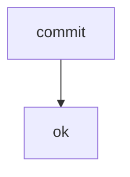

# Externe Payload-Referenz

_Generated from the memo database — not hand-written._

**Scope:** 1 blocks · 0 topics · 0 work items · 0 questions · 0 phases · 0 phase items

| Feld | Wert |
| --- | --- |
| **Memo** | M080 |
| **Memo-Name** | Externe Payload-Referenz |
| **Revision** | 01 |
| **Datum** | 2026-08-31 |
| **Status** | finalized |
| **Typ** | — |
| **Aenderungen** | — |

## Kontaminations-Metadaten

_no sessions_

## Kontext

Die Klammer endet an der Datei-Grenze.

## Blocks

### Zeiger (B001)

### User-Auftrag

_kein Inhalt_

### Ist-Zustand

_kein Inhalt_

### Soll-Zustand

_kein Inhalt_

### Topics

_kein Inhalt_

### Work-Items

_kein Inhalt_

### PRD-Zuordnung

_kein Inhalt_

### Belege

_kein Inhalt_

#### Primitives

```tsv
name	status
commit	ok
```

#### Flow



## Vorwort

_kein Inhalt_

## Offene Fragen

keine

## Beantwortete Fragen

_keine beantworteten Fragen_

## Phasen

_no phases_

## Phase-Hints

_kein Inhalt_

## Finalisierungs-Checkliste

_kein Inhalt_

## Ancillary Files

_kein Inhalt_

## Rollout-Entry-Points

_kein Inhalt_

## Lessons-Learned

_kein Inhalt_

## Work Items

_no work items_

## Topics

_no topics_

## Research

| R | Title | Kind | Topics | Files |
| --- | --- | --- | --- | --- |
| R1 | Vier Zustaende | wave-1 |  | project:context/drifted.md (GAP: checksum mismatch), project:context/gone.md (GAP: file missing), context/matched.md, project:context/unmeasured.md (GAP: never measured) |

## Fragen

```questions-json
[]
```

## Snags

_no snags_

## Goals

_no goals_

## Maintenance

_no maintenance cards_
