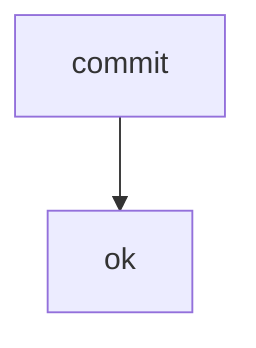

# DB Traceability

_Generated from the memo database — not hand-written._

**Scope:** 1 blocks · 2 topics · 2 work items · 2 questions · 1 phases · 1 phase items

| Feld | Wert |
| --- | --- |
| **Memo** | M079 |
| **Memo-Name** | DB Traceability |
| **Revision** | 01 |
| **Datum** | 2026-08-20 |
| **Status** | finalized |
| **Typ** | Full |
| **Aenderungen** | Erstfassung aus der Datenbank |

## Kontaminations-Metadaten

| Session | Role | Model | Started | Tokens | Tool calls |
| --- | --- | --- | --- | --- | --- |
| sess-lead | orchestrator | opus | 2026-08-20T09:00:00.000Z | 12800 | 42 |
| sess-worker | worker | opus | 2026-08-20T10:00:00.000Z | 4200 | 17 |

## Kontext

Kontext Zeile eins.
Kontext Zeile zwei.

## Blocks

### Backbone (B001)

### User-Auftrag

> "Die Revision soll aus der Datenbank entstehen."

### Ist-Zustand

- **[FAKT]** Der Erzeuger rendert je Block nur die Ueberschrift.

### Soll-Zustand

_kein Inhalt_

### Bewertung

Der Block war formal gueltig und trotzdem unlesbar.

### Topics

_kein Inhalt_

### Work-Items

_kein Inhalt_

### PRD-Zuordnung

_kein Inhalt_

### Belege

_kein Inhalt_

#### Primitives

```tsv
name	status
commit	ok
```

#### Flow



## Vorwort

Diese Revision entsteht aus der Datenbank.

## Offene Fragen

- **F1** (info): Soll die DB die SoT sein?

## Beantwortete Fragen

### F2 — Phasen-Normalisierung

- **Frage (Original):** Wie werden Phasen normalisiert?
- **AI-Empfehlung war:** A
- **User-Entscheidung:** A — Aus rollout/state.json projizieren
- **Wortlaut:** A — Normalisierung laeuft aus rollout/state.json.

## Phasen

### Backbone (P1)

- Status: done

| ID | Title | Status | Target | Type |
| --- | --- | --- | --- | --- |
| PRD-01 | adapter | done | core | code |

## Phase-Hints

- P1 kann parallel zu P2 laufen.

## Finalisierungs-Checkliste

- [x] Evidenz geprueft

## Ancillary Files

1. `context/research/2026-08-19--doltlite-machbarkeit.md`

## Rollout-Entry-Points

1. `cli/src/RevisionAssembler.mjs`

## Lessons-Learned

Ein Traeger fehlt erst dann auf, wenn er gerendert werden soll.

## Work Items

| ID | Topic | Title | Status | Group |
| --- | --- | --- | --- | --- |
| WI-01 | store | adapter | done | A |
| WI-02 | assemble | render from DB | open | B |

## Topics

| ID | Title | Phase | Block | Origin |
| --- | --- | --- | --- | --- |
| T01 | DB als SoT | P1 | B001 | init |
| T02 | Traceability | P2 |  |  |

## Research

| R | Title | Kind | Topics | Files |
| --- | --- | --- | --- | --- |
| R1 | doltlite Machbarkeit | wave-2 | T01 | context/research/2026-08-19--doltlite-machbarkeit.md |
| R2 | Memo-Korpus | wave-2 | T01, T02 |  |

## Fragen

```questions-json
[
  {
    "id": "F1",
    "title": "DB als Source of Truth",
    "hintergrund": "Kap 5: die Datenbank traegt die Wahrheit.",
    "frage": "Soll die DB die SoT sein?",
    "aiRecommendation": "A",
    "typ": "single",
    "options": [
      {
        "key": "A",
        "label": "Ja — die DB ist die SoT",
        "kind": "option"
      },
      {
        "key": "B",
        "label": "Nein — die Files bleiben SoT",
        "kind": "option"
      }
    ],
    "answered": false
  },
  {
    "id": "F2",
    "title": "Phasen-Normalisierung",
    "hintergrund": "Rollout-State liegt normalisiert in der DB.",
    "frage": "Wie werden Phasen normalisiert?",
    "aiRecommendation": "A",
    "typ": "single",
    "options": [
      {
        "key": "A",
        "label": "Aus rollout/state.json projizieren",
        "kind": "option"
      },
      {
        "key": "B",
        "label": "Manuell in der DB pflegen",
        "kind": "option"
      }
    ],
    "answered": true
  }
]
```

## Snags

| ID | Title | Status | Verdict | Disposition |
| --- | --- | --- | --- | --- |
| 079-tag-grenze | tag-grenze | open | offen | traced |

## Goals

| ID | Name | Kind | Pct | Status |
| --- | --- | --- | --- | --- |
| G-001 | DB als SoT | capability | 65 | open |

## Maintenance

| Repo | Freshness | Blast | Status |
| --- | --- | --- | --- |
| core | 82 | 3 | ok |
