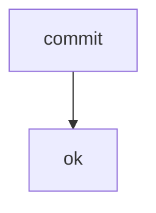

# DB Traceability

- ID: M079
- Type: strategy
- Status: finalized

## Kontext

Kontext Zeile eins.
Kontext Zeile zwei.

## Work Items

| ID | Topic | Title | Status | Group |
| --- | --- | --- | --- | --- |
| WI-01 | store | adapter | done | A |
| WI-02 | assemble | render from DB | open | B |

## Blocks

### Backbone (B001)

#### Primitives

```tsv
name	status
commit	ok
```

#### Flow



## Topics

| ID | Title | Phase | Block | Origin |
| --- | --- | --- | --- | --- |
| T01 | DB als SoT | P1 | B001 | init |
| T02 | Traceability | P2 |  |  |

## Phasen

### Backbone (P1)

- Status: done

| ID | Title | Status | Target | Type |
| --- | --- | --- | --- | --- |
| PRD-01 | adapter | done | core | code |

## Fragen

```questions-json
[
  {
    "id": "F1",
    "frage": "Soll die DB die SoT sein?",
    "kind": "info",
    "answered": false
  },
  {
    "id": "F2",
    "frage": "Wie werden Phasen normalisiert?",
    "kind": "info",
    "answered": true
  }
]
```

## Offene Fragen

- **F1** (info): Soll die DB die SoT sein?
