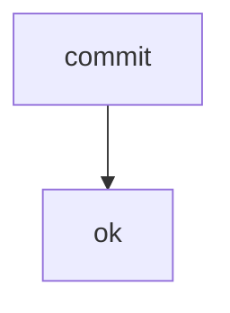

# DB Traceability

- ID: M079
- Type: strategy
- Status: finalized

## Kontext

Kontext Zeile eins.
Kontext Zeile zwei.

## Work Items

| ID | Topic | Title | Status | Group |
| --- | --- | --- | --- | --- |
| WI-01 | store | adapter | done | A |
| WI-02 | assemble | render from DB | open | B |

## Blocks

### Backbone (B001)

#### Primitives

```tsv
name	status
commit	ok
```

#### Flow



## Topics

| ID | Title | Phase | Block | Origin |
| --- | --- | --- | --- | --- |
| T01 | DB als SoT | P1 | B001 | init |
| T02 | Traceability | P2 |  |  |

## Phasen

### Backbone (P1)

- Status: done

| ID | Title | Status | Target | Type |
| --- | --- | --- | --- | --- |
| PRD-01 | adapter | done | core | code |

## Research

| R | Title | Kind | Topics | Files |
| --- | --- | --- | --- | --- |
| R1 | doltlite Machbarkeit | wave-2 | T01 | context/research/2026-08-19--doltlite-machbarkeit.md |
| R2 | Memo-Korpus | wave-2 | T01, T02 |  |

## Fragen

```questions-json
[
  {
    "id": "F1",
    "title": "DB als Source of Truth",
    "hintergrund": "Kap 5: die Datenbank traegt die Wahrheit.",
    "frage": "Soll die DB die SoT sein?",
    "aiRecommendation": "A",
    "typ": "single",
    "options": [
      {
        "key": "A",
        "label": "Ja — die DB ist die SoT",
        "kind": "option"
      },
      {
        "key": "B",
        "label": "Nein — die Files bleiben SoT",
        "kind": "option"
      }
    ],
    "answered": false
  },
  {
    "id": "F2",
    "title": "Phasen-Normalisierung",
    "hintergrund": "Rollout-State liegt normalisiert in der DB.",
    "frage": "Wie werden Phasen normalisiert?",
    "aiRecommendation": "A",
    "typ": "single",
    "options": [
      {
        "key": "A",
        "label": "Aus rollout/state.json projizieren",
        "kind": "option"
      },
      {
        "key": "B",
        "label": "Manuell in der DB pflegen",
        "kind": "option"
      }
    ],
    "answered": true
  }
]
```

## Offene Fragen

- **F1** (info): Soll die DB die SoT sein?
