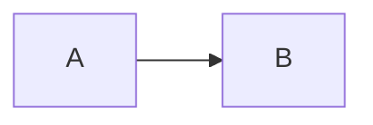
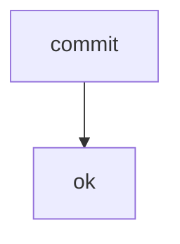

# DB Traceability

_Erzeugt aus der Memo-Datenbank `memo-079.db` durch `memo revision assemble`, geprueft durch `memo revision parity` — nicht hand-geschrieben._

**Umfang dieses Memos:** 1 Kapitel · 5 gestellte und beantwortete Fragen · 1 PRDs · 1 Phasen (P0–P0) · 2 Topics (1 registriert) · 2 Work-Items (0 lebendig) · 1 Phasen-Items. Gerechnet, nicht behauptet — `memo revision parity`.

| Feld | Wert |
| --- | --- |
| **Memo** | M079 |
| **Memo-Name** | DB Traceability |
| **Revision** | 01 |
| **Datum** | 2026-08-20 |
| **Status** | finalized |
| **Typ** | Full |
| **Aenderungen** | Erstfassung aus der Datenbank |

## Kontaminations-Metadaten

| Session | Role | Model | Started | Tokens | Tool calls |
| --- | --- | --- | --- | --- | --- |
| sess-lead | orchestrator | opus | 2026-08-20T09:00:00.000Z | 12800 | 42 |
| sess-worker | worker | opus | 2026-08-20T10:00:00.000Z | 4200 | 17 |

## Kontext

Kontext Zeile eins.
Kontext Zeile zwei.

## Blocks

### Backbone (B001)

### User-Auftrag

> "Die Revision soll aus der Datenbank entstehen."

### Ist-Zustand

- **[FAKT]** Der Erzeuger rendert je Block nur die Ueberschrift.

### Soll-Zustand

_kein Inhalt_

### Anker-Tabelle

| stufe | wert |
|---|---|
| zwei | ja |

### Anker-Diagramm



### Bewertung

Der Block war formal gueltig und trotzdem unlesbar.

### Topics

_kein Inhalt_

### Work-Items

_kein Inhalt_

### Abhaengigkeiten

_kein Inhalt_

### PRD-Zuordnung

_kein Inhalt_

### Belege

_kein Inhalt_

### Primitives

```tsv
name	status
commit	ok
```

### Flow



## Vorwort

Diese Revision entsteht aus der Datenbank.

## Offene Fragen

- **F1** (info): Soll die DB die SoT sein?

## Beantwortete Fragen

### Vom User beantwortet

### F2 — Phasen-Normalisierung

- **Frage (Original):** Wie werden Phasen normalisiert?
- **AI-Empfehlung war:** A
- **User-Entscheidung:** A — Aus rollout/state.json projizieren
- **Wortlaut:** A — Normalisierung laeuft aus rollout/state.json.
- **Beantwortet in:** REV-02
- **Anmerkung:** Muendliche Aussage uebersteuert die Widget-Auswahl

### Von der KI im Namen des Users beantwortet

### F3 — Antwort-Herkunft

- **Frage (Original):** Wie wird die Herkunft gefuehrt?
- **AI-Empfehlung war:** A
- **User-Entscheidung:** —
- **Beantwortet in:** REV-03

## Phasen

### Backbone (P1)

- Status: done

| ID | Title | Status | Target | Type |
| --- | --- | --- | --- | --- |
| PRD-01 | adapter | done | core | code |

## Phase-Hints

- P1 kann parallel zu P2 laufen.

## Finalisierungs-Checkliste

- [x] Evidenz geprueft

## Ancillary Files

1. `context/research/2026-08-19--doltlite-machbarkeit.md`

## Rollout-Entry-Points

1. `cli/src/RevisionAssembler.mjs`

## Lessons-Learned

Ein Traeger fehlt erst dann auf, wenn er gerendert werden soll.

| LL | Lesson | Phase | PRD | Herkunft | Entstanden |
| --- | --- | --- | --- | --- | --- |
| LL-001 | Eine Kennung, die aufloest, ist noch keine richtige — Work-Item-Kennungen sind memo-lokal. | P1 | PRD-16 | M076/WI-109 · M079/REV-01:42 | 2026-08-20T11:00:00.000Z |

## Work Items

| ID | Topic | Title | Status | Group |
| --- | --- | --- | --- | --- |
| WI-01 | store | adapter | done | A |
| WI-02 | assemble | render from DB | open | B |

## Topics

| ID | Title | Phase | Block | Origin |
| --- | --- | --- | --- | --- |
| T01 | DB als SoT | P1 | B001 | init |
| T02 | Traceability | P2 |  |  |

## Research

| R | Title | Kind | Topics | Files |
| --- | --- | --- | --- | --- |
| R1 | doltlite Machbarkeit | wave-2 | T01 | context/research/2026-08-19--doltlite-machbarkeit.md |
| R2 | Memo-Korpus | wave-2 | T01, T02 |  |

## Zurueckgestellte Fragen

### F4 — Zaehler-Frage

- **Frage (Original):** Braucht der Zaehler eine dritte Zahl?
- **Zurueckgestellt:** irrelevant
- **Begruendung:** die Messung in Kap 25 hat sie beantwortet

### F5 — Abgeloeste Fassung

- **Frage (Original):** Alte Fassung der SoT-Frage?
- **Zurueckgestellt:** ersetzt durch F1
- **Begruendung:** F1 stellt dieselbe Entscheidung praeziser

## Fragen

```questions-json
[
  {
    "id": "F1",
    "title": "DB als Source of Truth",
    "hintergrund": "Kap 5: die Datenbank traegt die Wahrheit.",
    "frage": "Soll die DB die SoT sein?",
    "aiRecommendation": "A",
    "typ": "single",
    "options": [
      {
        "key": "A",
        "label": "Ja — die DB ist die SoT",
        "kind": "option"
      },
      {
        "key": "B",
        "label": "Nein — die Files bleiben SoT",
        "kind": "option"
      }
    ],
    "answered": false,
    "status": "open",
    "statusReason": null,
    "replacedBy": null,
    "answeredBy": null,
    "answeredInRev": null,
    "note": null
  },
  {
    "id": "F2",
    "title": "Phasen-Normalisierung",
    "hintergrund": "Rollout-State liegt normalisiert in der DB.",
    "frage": "Wie werden Phasen normalisiert?",
    "aiRecommendation": "A",
    "typ": "single",
    "options": [
      {
        "key": "A",
        "label": "Aus rollout/state.json projizieren",
        "kind": "option"
      },
      {
        "key": "B",
        "label": "Manuell in der DB pflegen",
        "kind": "option"
      }
    ],
    "answered": true,
    "status": "answered",
    "statusReason": null,
    "replacedBy": null,
    "answeredBy": "user",
    "answeredInRev": "REV-02",
    "note": "Muendliche Aussage uebersteuert die Widget-Auswahl"
  },
  {
    "id": "F3",
    "title": "Antwort-Herkunft",
    "hintergrund": "Kap 18: wer geantwortet hat, ist Teil des Records.",
    "frage": "Wie wird die Herkunft gefuehrt?",
    "aiRecommendation": "A",
    "typ": "single",
    "options": [
      {
        "key": "A",
        "label": "Zwei Unter-Abschnitte",
        "kind": "option"
      }
    ],
    "answered": true,
    "status": "answered",
    "statusReason": null,
    "replacedBy": null,
    "answeredBy": "ai-on-behalf",
    "answeredInRev": "REV-03",
    "note": null
  },
  {
    "id": "F4",
    "title": "Zaehler-Frage",
    "hintergrund": "Kap 18: nichts verschwindet still.",
    "frage": "Braucht der Zaehler eine dritte Zahl?",
    "aiRecommendation": "A",
    "typ": "single",
    "options": [
      {
        "key": "A",
        "label": "Ja",
        "kind": "option"
      }
    ],
    "answered": false,
    "status": "irrelevant",
    "statusReason": "die Messung in Kap 25 hat sie beantwortet",
    "replacedBy": null,
    "answeredBy": null,
    "answeredInRev": null,
    "note": null
  },
  {
    "id": "F5",
    "title": "Abgeloeste Fassung",
    "hintergrund": "Kap 18: die Genealogie ist eine Kante.",
    "frage": "Alte Fassung der SoT-Frage?",
    "aiRecommendation": "A",
    "typ": "single",
    "options": [
      {
        "key": "A",
        "label": "Ja",
        "kind": "option"
      }
    ],
    "answered": false,
    "status": "replaced",
    "statusReason": "F1 stellt dieselbe Entscheidung praeziser",
    "replacedBy": "F1",
    "answeredBy": null,
    "answeredInRev": null,
    "note": null
  }
]
```

## Snags

| ID | Title | Status | Verdict | Disposition |
| --- | --- | --- | --- | --- |
| 079-tag-grenze | tag-grenze | open | offen | traced |

## Goals

| ID | Name | Kind | Pct | Status |
| --- | --- | --- | --- | --- |
| G-001 | DB als SoT | capability | 65 | open |

## Maintenance

| Repo | Freshness | Blast | Status |
| --- | --- | --- | --- |
| core | 82 | 3 | ok |
