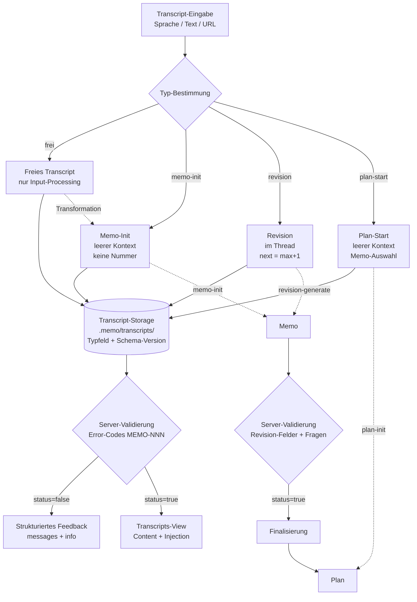

# Transcript-System als Eintrittspunkt

| Feld | Wert |
|------|------|
| **Memo** | 016 |
| **Memo-Name** | Transcript-System als Eintrittspunkt |
| **Revision** | REV-05 |
| **Datum** | 2026-05-26 18:55 |
| **Status** | Finalisiert |
| **Memo-Typ** | Implementierung (Sekundaer-Tag: Strategie) |
| **Typ** | Full |
| **Aenderungen** | Finalisierung: Quality-Checks (evidence/balance/coherence/references) ausgefuehrt, Evidenz-Uebersicht + Finalisierungs-Pruefung ergaenzt, Status → Finalisiert. Inhalt = REV-04 |

---

## Kontext

| Key | Wert |
|-----|------|
| **Projekt** | memo-view (memo-toolkit) — `cli/memo-toolkit/editor/` |
| **Repos** | `cli/memo-toolkit/` (kein eigenes Git-Repo, Teil der Workbench) |
| **Betroffene Bereiche** | `editor/src/MemoView.mjs` (Sidebar, Top-Toggle, Transcript-Modal, Frage-Widget, Sticky-Header, HTTP-Endpoints), `editor/src/TranscriptRegistry.mjs` (Storage), `editor/src/TranscriptHeader.mjs` (Prompt-Injection / Default-Header), `editor/src/DocumentRegistry.mjs` (Tree, Sortierung, Frage-Parser, neuer Validator), Skills `memo-input-processing`, `memo-init`, `memo-revision-generate` (Frage-Format) |
| **Referenzmaterial** | Transcripts REV-01..04 (`~/Desktop/transcript-sidebar.txt` + Server-Storage); Screenshots; Error-Code-Vorbild `github.com/agentprobe/erc8004-registry-parser` (analysiert, nicht voll geladen); Skill `node-error-codes`; Vorgaenger-Memos 011/013/014/015 |

> **Sprach-Transkriptions-Hinweis:** "Transcript"→"Skript/Script", "rausparsen"→"rauspassen", "Antwort-Injektion"→"Autoinjektion", "Pointer-/Hand-Cursor"→"Handschuh", "zurueckfliessen"→"zusammenfliessen", "JSON"→"Jason". Korrekturen angewandt. Screenshots "konterminierung"/HANDOVER.md = anderes Thema.

---

## 1. Ausgangslage & Problem-Kontext [Docs]

Das Memo-System hat neue Features bekommen (Transcript-Staging, URL-Modus, Plan/Viewer-Vereinheitlichung, Frage-Widget). Beim ersten echten End-to-End-Durchlauf ist der User in eine **Kaskade von Problemen** gelaufen. Ursache ist ein strukturelles Defizit: **End-to-End-Tests werden zu oft ausgelassen**, daher fallen Diskrepanzen erst auf, wenn der User selbst zum E2E-Tester wird.

**Leitprinzip (User-Zitat, sinngemaess):** "Nicht alles auf die LLM schieben — wie koennen wir unser System so verbessern, dass das einfach weniger passiert." Daher: ganzheitliche Neuordnung des Transcript-Systems, plus die Frage-Widget-Defekte, plus eine **deterministische Server-Validierung** (Kap 13), die genau diese E2E-Luecke maschinell schliesst.

**Kern-Erkenntnis:** Transcripts sind der **Eintrittspunkt des gesamten Systems**: Transcript → Memo → Revision → (Finalisierung) → Plan.

---

## 2. Transcripts als dritter Hauptbereich [Code]

Der Top-Toggle kennt heute **Memos** und **Plans** (`MemoView.mjs:2301-2304`, `applyMode()` 3290-3317). Es fehlt **Transcripts**.

**Soll:**
- Top-Toggle: **Transcripts | Memos | Plans** (Transcripts zuerst, Eintrittspunkt).
- Transcripts werden **in Transcripts** abgelegt, nicht unter Memos. "other"-Transcripts (`TranscriptRegistry.addOtherTranscript()` 417-500, `.memo/transcripts/`) gehoeren dorthin.
- Transcripts **ohne Memo-Bezug** ablegbar (Transcripts-Button oben).
- Kette: **Transcript → Memo → Revision → (Finalisierung) → Plan**.

**PRD-Vorbereitung:**
| PRD | Benoetigt aus diesem Kapitel | Benoetigt zusaetzlich |
|-----|------------------------------|----------------------|
| Top-Toggle-Erweiterung | Reihenfolge + Aktiv-Logik | `applyMode`-Code |
| Transcript-Storage-Konsolidierung | Ablage freier Transcripts (`.memo/transcripts/` + Typfeld, F4) | `TranscriptRegistry`-Layout |

### 2.1 Breaking Change & Versions-Marker (Folge F5) [Code]

Statt Migration: bewusster **Breaking Change** (beantwortete F5). Begruendung: Migrationsproblem groesser als gedacht — auch alte Revisionen werden falsch angezeigt.

**Soll:** `memo-init` (+ schreibende Skills) schreiben einen **Versions-Marker** (z.B. `Schema-Version: 2`) in jede neue Datei. Beim Einlesen prueft der Server das Schema; Nicht-Konforme werden als "Legacy / nicht unterstuetzt" markiert statt falsch gerendert. Keine Auto-Migration.

**PRD-Vorbereitung:**
| PRD | Benoetigt aus diesem Kapitel | Benoetigt zusaetzlich |
|-----|------------------------------|----------------------|
| Versions-Marker-Feld | Marker-Format + Schreibstelle | Header-Vertrag (Kap 3) |
| Legacy-Detection | Marker-Check + Status | `DocumentRegistry`/`TranscriptRegistry` Scan |

---

## 3. Transcript-Typen & korrekte Prompt-Injection [Code]

**Kritischstes Kapitel.** `TranscriptHeader.build()` (`TranscriptHeader.mjs:30-47`) generiert fuer JEDES Transcript denselben Default-Header:
- **Memo-Nummer `000`** (Zeile ~32, Fallback bei `memoId` ohne Zahlen-Praefix) — falsch.
- **Vorherige/Naechste Revision** — fuer neue Memos sinnlos.

**Sticky-Header-Nummern-Verwirrung:** Der Generator leitet aus dem Transcript-Suffix blind `previous = suffix, next = suffix+1` ab. Konsequenz (User-O-Ton): "Ich gucke Revision 2 an, gebe einen Transcript ab, und es steht 'fuer Revision 3'." Doppeldeutig: Ein Transcript zur **Erstellung von REV-N+1** ist zugleich **Feedback zu REV-N**. Der Sticky-Header nimmt immer die *aktuell betrachtete* Version als Basis und findet ggf. den falschen Transcript. Die Namensgebung verwirrt sogar die AI.

**Live-Belege:** REV-02-Transcript nannte REV-03 (real REV-02); REV-03-Transcript nannte REV-04 (real REV-03); REV-04-Transcript nannte REV-05 (real REV-04). Drei Instanzen desselben Off-by-one.

**Soll-Nummern-Logik:** `next = (hoechste existierende REV-Nummer) + 1`, `previous = hoechste existierende`. Nicht aus dem Transcript-Suffix ableiten. UI zeigt klar: "Feedback zu REV-N → erzeugt REV-N+1".

**Warum gefaehrlich (Kontext-Erhalt):** Injizierte Prompts stehen am Uebergang Sprache→Dokument. Falsche Info = grosse Diskrepanz; die AI interpretiert Falsches als Fakt. Injektion muss **100% korrekt** sein.

**Die vier Transcript-Typen** (Plan-Start vollwertig, F3=A):

| Typ | Zweck | Kontext-Modus | Injizierter Prompt (Soll) |
|-----|-------|---------------|---------------------------|
| **Frei / undefiniert** | Kein vordefinierter Zweck. Wird **immer gespeichert** (Analyse). | Im Thread | "Achtung Transcript. Input-Processing — aber KEINE Revision/Memo." Keine Nummer/Revision. |
| **Memo-Init** | Neues Memo. | Leerer Kontext | `memo-input-processing` → `memo-init`. Keine Nummer (Ort unbekannt), keine Revisions-Felder. |
| **Revision** | Revision fuer bestehendes Memo. | Im Thread | `memo-input-processing` → `memo-revision-generate`. Nummern via Soll-Logik oben. |
| **Plan-Start** | Plan starten; mehrere Memos auswaehlen. | Leerer Kontext | Plan-Erstellung + Memo-Auswahl; `memo-plan-init`/`memo-plan-add`. |

**Real-World-Constraint:** Bei Memo-Init + Plan-Start ist der Ablageort unbekannt (viele `.memo/`-Ordner). Injektion darf den Ort nicht vordefinieren.

**PRD-Vorbereitung:**
| PRD | Benoetigt aus diesem Kapitel | Benoetigt zusaetzlich |
|-----|------------------------------|----------------------|
| Transcript-Typ-Datenmodell | 4-Typen-Enum + Kontext-Modus + Injection-Template | `TranscriptHeader`/`TranscriptRegistry` |
| Header-Nummern-Fix | `next = max+1`, kein Suffix-Ableiten; UI "Feedback zu REV-N → REV-N+1" | bestehende Build-Logik |
| Header-Vertrag-Sync | `HEADER_LINE_REGEX` in `memo-input-processing` | Konsistenz Skill ↔ Server |

---

## 4. Transcript-View [Code]

Eigene View fuer Transcripts, analog zur Memos-View: **Mitte** = Transcript-Inhalt + typ-spezifische Prompt-Injection (Kap 3); **Seite** = letzte Transcripts der Ablageorte. Diskrepanzen fallen sofort auf.

**PRD-Vorbereitung:**
| PRD | Benoetigt aus diesem Kapitel | Benoetigt zusaetzlich |
|-----|------------------------------|----------------------|
| Transcript-View | Layout (Content + Injection mittig, Liste seitlich) | Memos-View als Vorlage |

---

## 5. Transcript ↔ Memo-Zuordnung & Transformation [Code]

Zuordnung: **lose** ("gehoert zu Memo 15") oder **explizit fuer eine Revision** (Tab "Zu Revision hinzufuegen" `MemoView.mjs:2322-2340`).

**Badge-Korrektheit (Feedback REV-03):** Das "Transcript hinterlegt"-Badge wird faelschlich fuer Revisionen gezeigt, die selbst keinen Transcript haben. Die Badge-/Indikator-Logik muss die Zuordnung **pro Revision** korrekt aufloesen.

**Sticky-Header-Button:** "Transcript fuer diese Revision einfuegen" legt automatisch ein Revision-Transcript an — mit korrekter Nummern-Logik (Kap 3): zeigt "Feedback zu REV-N, erzeugt REV-N+1", prueft Existenz fuer **REV-N+1**.

**Transformation:** Freies Transcript → Memo-Init-Transcript (Re-Injection, Kap 3).

**PRD-Vorbereitung:**
| PRD | Benoetigt aus diesem Kapitel | Benoetigt zusaetzlich |
|-----|------------------------------|----------------------|
| Zuordnungs-Modell + Badge-Fix | lose vs. explizit-Revision; korrekte Pro-Revision-Aufloesung | Tab-1-Logik + Indikator-Render |
| Transcript-Transformation | Typ-Wechsel + Re-Injection | Typ-Modell Kap 3 |
| Sticky-Header-Button | Auto-Anlage + korrekte Nummern | Kap 3 Nummern-Logik |

---

## 6. Sidebar-Queue & Sortierung [Code]

**6.1 Queue oben:** Warteschlange der unerledigten Revisionen/Memos; Namespaces darunter **ab sofort immer zugeklappt**.

**6.2 Zwei gegensaetzliche Sortierungen (bewusst):**
| Liste | Sortierung | Begruendung |
|-------|-----------|-------------|
| **Queue** | **Aeltestes oben (FIFO)** | Aeltestes zuerst abarbeiten. |
| **Memos** | **Neueste oben** | Wichtigstes zuerst. Heute verkehrt (`getDocumentTree` 175-215). |

**6.3 Auto-Move:** Eingetragener Transcript → Eintrag verlaesst die Queue.

**PRD-Vorbereitung:**
| PRD | Benoetigt aus diesem Kapitel | Benoetigt zusaetzlich |
|-----|------------------------------|----------------------|
| Sidebar-Queue | offene Revisionen, FIFO, Auto-Move | `getOpenFinalizedMemos` 218-239 |
| Memo-Sortierung umdrehen | Sort absteigend | `getDocumentTree` 175-215 |
| Namespace-Collapse-Default | Standard collapsed | Sidebar-Render |

---

## 7. Sidebar-Darstellung, Hover & Klarheit [Code]

**7.1 Darstellungsfixes:** Badge-Hoehe ("Bedingt finalisiert" 2 Zeilen vs "Finalisiert" 1) → einheitliche Zeilenhoehe; inkonsistente Trennstriche → konsistente Separatoren; springende Badge-Position → feste Position. (`MemoView.mjs:2779-2780`, `badgeClassFor()` 2514-2520, CSS `.memo-head` 941-977, `.memo-badge` 1141-1171.)

**7.2 Hover-Regression:** Aktuell kein Hover beim Drueberfahren (nur auf bereits ausgewaehlter Zeile), inkonsistent zwischen Memos. Soll: **einheitlicher, dezenter Hover** (leicht grau) fuer alle Zeilen, klar unterscheidbar vom Selected-State.

**7.3 Sidebar-Klarheit / Emoji-Reduktion:** Die Sidebar ist "sehr undurchsichtig", zu viele Emojis, Orientierungsverlust. Soll: Emoji-/Icon-Last reduzieren, klare Hierarchie, sichtbarer "aktueller Stand".

**7.4 Word-Count/Zeit-Anzeige:** Sticky-Header zeigt "… Woerter · 21 Min" wie eine User-Eingabe, obwohl es die Transcript-Laenge ist. Soll: klar als Transcript-Laenge labeln.

**PRD-Vorbereitung:**
| PRD | Benoetigt aus diesem Kapitel | Benoetigt zusaetzlich |
|-----|------------------------------|----------------------|
| Sidebar-Layout-Fix | feste Zeilenhoehe, Separatoren, Badge-Position | CSS + Render |
| Hover-Vereinheitlichung | einheitlicher Hover, getrennt vom Selected | `.memo-head` Hover-CSS |
| Sidebar-Klarheit | Emoji-Reduktion, Hierarchie | Sidebar-Render |
| Sticky-Header-Labeling | Transcript-Laenge korrekt labeln | Sticky-Header |

---

## 8. Clipboard-UX [Code]

Heute: speichern → Link → separat "Kopieren" (`copyTranscriptUrl()` 3657-3671). User hat **Angst, den Link zu verlieren**.

**Soll:** beim ersten Speichern URL **sofort** in Zwischenablage; zusaetzlich kleines, unauffaelliges Copy-Symbol neben dem Link; bisheriger Flow + Klick-zum-Schliessen bleiben ok.

**PRD-Vorbereitung:**
| PRD | Benoetigt aus diesem Kapitel | Benoetigt zusaetzlich |
|-----|------------------------------|----------------------|
| Auto-Clipboard | `navigator.clipboard.writeText` nach Save | Save-Flow 3540-3601 |
| Inline-Copy-Icon | kleines Icon + Klick-zum-Schliessen | Modal |

---

## 9. UI-Verifikation: Pencil + Playwright [Code]

**Status: bestaetigt als eigene Phase** (beantwortete F2 = A). Skills `image-mockup-pencil` (S/W-Wireframe) + `image-pencil-playwright-diff` (Soll-Ist via computed styles). Vorgehen: pro View zuerst Pencil-Mockup, dann frame-treu bauen, dann Soll-Ist-Diff.

**PRD-Vorbereitung:**
| PRD | Benoetigt aus diesem Kapitel | Benoetigt zusaetzlich |
|-----|------------------------------|----------------------|
| UI-Verifikations-Pass | Soll-Komponenten + Pencil-Frame-IDs | `image-mockup-pencil`, `image-pencil-playwright-diff` |

---

## 10. Architektur-Uebersicht [Diagramme]

---

## 11. Frage-Widget: Parsing, Darstellung & Navigation [Code]

Das Frage-Widget (PRD-012/015, Memo 014 Kap 12/18) rendert nach dem Format-Fix korrekt (REV-03-Screenshot: F1-Checkbox sichtbar). Offene Defekte:

**11.1 Parsing A/B/C (BEHOBEN im Format, Parser-Fix offen):** Inline `(A)/(B)/(C)` parst `#extractOptions` (`DocumentRegistry.mjs:601`) nicht — der Buchstabe darf nicht in Klammern stehen. **Skill-Seite** emittiert jetzt diskrete Zeilen `A) … / B) …`; **Parser-Seite** sollte zusaetzlich `(A)` tolerieren, damit ungenaue Schreibweisen nicht stumm fehlschlagen.

**11.2 KI-Empfehlung anzeigen + vorselektieren:** `#resolvePreselected` (`693`) matcht `\b[A-H]\b`. Empfehlung sichtbar rendern + Option vorselektieren (verifiziert: F1 A-D, F6 B, F7 C).

**11.3 Checkliste = Multi-Select:** `#detectType` (`633`) — Checkliste traegt `**Typ:** multi` + Optionen; andere Fragen single. Verifiziert.

**11.4 Typografie:** `renderQuestionFocus` (`MemoView.mjs:4354`) — Hintergrund / Frage / AI-Empfehlung klar gelabelt + getrennt.

**11.5 Karussell-Wrap:** Shift+Hoch/Runter (`4450-4453`, `delta=±1`) → zirkulaer via `(index + delta + n) % n`.

**11.6 Topic-Links reparieren:** Eintraege wie "Topic 11.7" zeigen einen Pointer-Cursor (sehen klickbar aus), springen aber nicht zur Stelle. `topicPositions` (`#extractTopicPositions` 667) + "Ueber das Topic springen" muessen tatsaechlich scrollen — sonst kein Link-Cursor.

**11.7 Frage-Sprung-Feature** (Shift+Hoch/Runter) ist gewuenschtes Verhalten (inkl. Wrap 11.5).

**PRD-Vorbereitung:**
| PRD | Benoetigt aus diesem Kapitel | Benoetigt zusaetzlich |
|-----|------------------------------|----------------------|
| Frage-Parser-Fix | diskretes Format (Skill) + paren-tolerant `#extractOptions` | Frage-Format |
| Empfehlung + Multi/Single + Typografie | Render + `#detectType`/`#resolvePreselected` | 11.1 |
| Karussell-Wrap | Modulo im Shift-Handler | `4450-4453` |
| Topic-Sprung-Fix | echter Scroll-to-Topic oder kein Link-Cursor | `topicPositions` 667 |

---

## 12. Antwort-Injektion & Transcript-Vollstaendigkeit [Code]

**F6 beantwortet = B** (maschinell injizieren), mit klarer Verfeinerung:

**12.1 Schneller Flow ohne Popup:** Fragen mit Shift durchgehen, Option waehlen, **"Hinzufuegen"** klicken → der Button **veraendert sich sichtbar** ("hinzugefuegt"). KEIN Popup. Wo/wie im Hintergrund gespeichert wird, ist egal — Hauptsache deterministisch + sichtbar bestaetigt.

**12.2 Vollstaendigkeits-Regel (Kontext-Erhalt):** Nur gespeicherte Fragen-Antworten ergeben **kein vollstaendiges** Transcript. Gefahr: man koennte glauben "ein Transcript ist hinterlegt", obwohl nur die Fragen drin sind — der **Kontext fehlt**. Ein Revisions-Transcript ist erst **abgeschlossen**, wenn ein **echter Transcript** hinterlegt ist (mit oder ohne Widget-Fragen). Das Fragen-Ausfuellen ist eine **optionale** Ergaenzung.

**12.3 "Ohne Transcript speichern"-Button:** Wenn der User nur Antworten ausgewaehlt hat und bewusst keinen echten Transcript hinterlegen will, gibt es den expliziten Button **"ohne Transcript speichern"**. Dann gilt der Transcript (in Anfuehrungszeichen) als gespeichert — nur mit Fragen-Antworten. Default bleibt: echter Transcript = vollstaendig.

**PRD-Vorbereitung:**
| PRD | Benoetigt aus diesem Kapitel | Benoetigt zusaetzlich |
|-----|------------------------------|----------------------|
| Antwort-Injektion (maschinell) | strukturierte Injektion + Button-Statuswechsel ohne Popup | Frage-Widget State |
| Transcript-Vollstaendigkeits-Modell | "vollstaendig = echter Transcript"; Flag fuer "nur Antworten" | `TranscriptRegistry` |
| "Ohne Transcript speichern"-Button | expliziter Speicher-Pfad ohne Transcript-Text | Save-Flow |

---

## 13. Server-seitige Revisions-Validierung mit Error-Codes [Code]

**Idee (User):** Revisionen gehen ohnehin ueber den Server zur AI. Dort eine **echte, deterministische Validierung** mit Error-Codes + Hinweisen — strukturell, mit professionellem Feedback. Nicht inhaltlich, sondern: Hat das Frage-Parsen funktioniert? Ist die Struktur korrekt? Re-Check mit klarer Meldung "Fragen falsch definiert". **AI-Empfehlung ist `required`** und wird erzwungen.

**Vorbild (Research, `agentprobe/erc8004-registry-parser`, analysiert):**
- **Format:** `PREFIX-NUMBER` (`MEMO-NNN` blockierend, `INFO-NNN` Advisory), Nummern in Themenbloecken mit Luecken, Buchstaben-Suffix fuer Varianten (`MEMO-012a`).
- **Result-Shape:** `{ status, messages, info }`, `status = messages.length === 0` (nie manuell). `info` blockiert nicht.
- **Kaskade pro Feld:** existence → type/format → value, mit `else if` (nur eine Meldung pro Feld). Feld-Pfad im Text (`F2.aiEmpfehlung:`), erwarteter Wert inline.
- **Required-Enforcement:** fehlend → "Missing required field"; malformed → eigener Code; leer → eigener Code.
- **Severity:** ERROR (messages) vs INFO (info); optional A/B/C-Grade ergaenzen (Skill `node-error-codes`).

**Konkrete Checks (Erstausbau):**
- Jede `### F{N}` hat Hintergrund, Frage, AI-Empfehlung (AI-Empfehlung **required** → Fehler-Code).
- Optionen parsebar (diskrete Zeilen, keine Klammern) — sonst `MEMO-NNN` "Optionen nicht parsebar".
- Typ-Badge `single`/`multi` konsistent; Checkliste = multi.
- Pflicht-Sections vorhanden (Kontext, Offene/Beantwortete Fragen, Phasen, Phase-Hints).
- Header-Felder vollstaendig + Schema-Version-Marker (Kap 2.1).

**Verzahnung:** Die Validierung laeuft als Gate im Server vor dem Ausliefern an View/AI (Diagramm Kap 10). Sie ist der maschinelle E2E-Check, der die Luecke aus Kap 1 schliesst — bevor falsch geparste Fragen "richtig gefaehrlich" werden. (Eigenbeleg: Beim Schreiben von REV-03 enthielt eine Option versehentlich Literaltext "B)"/"C)" und wurde fehl-geparst — genau das faengt diese Validierung kuenftig ab.)

**Format-Entscheidung (F7 = C, Hybrid — beantwortet):** Fragen werden als **JSON-Codeblock** im Memo hinterlegt (deterministische, parse-sichere Quelle) **plus** eine menschenlesbare **Markdown-Spiegelung** zur Anzeige im memo-view. Damit ist das Parsing-Risiko endgueltig geloest und die Lesbarkeit erhalten.

**PRD-Vorbereitung:**
| PRD | Benoetigt aus diesem Kapitel | Benoetigt zusaetzlich |
|-----|------------------------------|----------------------|
| Memo-Validator-Klasse | `validate({ doc })` + private `#validateX`; `{ status, messages, info }` | Skill `node-error-codes`, Research-Pattern |
| Error-Code-Katalog | `MEMO-NNN`/`INFO-NNN` Themenbloecke + Suffixe | node-error-codes Format |
| AI-Empfehlung-Required-Enforcement | Pflicht-Check + Re-Check | Frage-Parser Kap 11 |
| Fragen-JSON-Codeblock + Markdown-Spiegelung (F7=C) | JSON-Quelle generiert Markdown-Anzeige | Frage-Format Kap 11 |
| Validierungs-Gate im Server | Hook vor View/AI-Auslieferung | WebSocket-Pfad `MemoView.mjs:5652-5761` |

---

## Offene Fragen

keine

---

## Beantwortete Fragen

### F1 — Finalisierungs-Checkliste

- **Frage (Original):** Welche Quality-Checks sollen vor der Finalisierung ausgefuehrt werden?
- **AI-Empfehlung war:** memo-evidence, memo-balance, memo-coherence, memo-references ausfuehren; git-security + ralph-loop ueberspringen.
- **User-Entscheidung:** Zustimmung — genau diese vier ausfuehren, git-security + ralph-loop aus.
- **Beantwortet in:** REV-04
- **Anmerkung:** In die Finalisierungs-Checkliste (User-Spalte) uebernommen.

### F2 — Pencil/Playwright: Phase oder eigenes Memo

- **Frage (Original):** Soll die UI-Verifikation als eigene Phase, als separates Methodik-Memo, oder gar nicht formal laufen?
- **AI-Empfehlung war:** als Phase hier, gestuetzt auf bestehende Skills.
- **User-Entscheidung:** eigene Phase in diesem Memo.
- **Beantwortet in:** REV-02
- **Anmerkung:** Kap 9 + Phase "UI-Verifikation".

### F3 — Vierter Transcript-Typ (Plan-Start)

- **Frage (Original):** Plan-Start jetzt voll umsetzen, Modell auf 4 Typen mit UI spaeter, oder weglassen?
- **AI-Empfehlung war:** Modell auf 4 Typen, UI spaeter.
- **User-Entscheidung:** jetzt voll umsetzen (bewusst gegen die Empfehlung).
- **Beantwortet in:** REV-02
- **Anmerkung:** Kap 3 vollwertiger 4. Typ; eigene Phase.

### F4 — Ablageort freier Transcripts

- **Frage (Original):** `.memo/transcripts/` mit Typfeld, getrennte Unterordner, oder globaler Speicher?
- **AI-Empfehlung war:** `.memo/transcripts/` mit Typfeld.
- **User-Entscheidung:** `.memo/transcripts/` mit Typfeld.
- **Beantwortet in:** REV-02
- **Anmerkung:** Kap 2/3 + Diagramm.

### F5 — Migration bestehender "other"-Transcripts

- **Frage (Original):** automatisch migrieren, nur neue dort ablegen, oder per Befehl?
- **AI-Empfehlung war:** automatische idempotente Migration.
- **User-Entscheidung:** keine — Breaking Change mit Versions-Marker, alte nicht unterstuetzt.
- **Beantwortet in:** REV-02
- **Anmerkung:** Kap 2.1.

### F6 — Antwort-Injektion ins Transcript

- **Frage (Original):** Antworten als Markdown im Transcript, maschinell injiziert + im Popup angezeigt, oder kombiniert?
- **AI-Empfehlung war:** B — maschinell injizieren.
- **User-Entscheidung:** B — maschinell injizieren, mit Vollstaendigkeits-Regel + "ohne Transcript speichern"-Button + Button-Statuswechsel ohne Popup.
- **Beantwortet in:** REV-03
- **Anmerkung:** Kap 12.

### F7 — Fragen-Format JSON-Codeblock

- **Frage (Original):** Markdown mit diskreten Optionen, JSON-Codeblock, oder Hybrid?
- **AI-Empfehlung war:** C — Hybrid (JSON-Quelle + Markdown-Spiegelung).
- **User-Entscheidung:** C — Hybrid. "Hybrid finde ich super."
- **Beantwortet in:** REV-04
- **Anmerkung:** Kap 13 Format-Entscheidung fixiert.

---

## Phasen

### Phase 1: Transcript-Typ-Datenmodell, Nummern-Fix, Versions-Marker [Code]
- [ ] 4-Typen-Modell (frei / memo-init / revision / plan-start) [Code]
- [ ] Header-Nummern-Fix (`next = max+1`, kein Suffix-Ableiten) + Injection-Templates [Code]
- [ ] Versions-Marker + Legacy-Detection (Breaking Change) [Code]
- [ ] Header-Vertrag mit `memo-input-processing` synchronisieren [Code]
- [ ] Tests fuer alle 4 Typen [Code]

### Phase 2: Transcripts-Bereich & Transcript-View [Code]
- [ ] Top-Toggle "Transcripts" (zuerst) [Code]
- [ ] Storage konsolidieren (`.memo/transcripts/` + Typfeld) [Code]
- [ ] Transcript-View (Content + Injection mittig, Liste seitlich) [Code]

### Phase 3: Zuordnung, Badge-Fix, Transformation & Sticky-Header [Code]
- [ ] Lose vs. explizite Revision-Zuordnung [Code]
- [ ] "Transcript hinterlegt"-Badge pro Revision korrekt [Code]
- [ ] Transcript-Transformation (frei → memo-init) [Code]
- [ ] Sticky-Header-Button + korrekte Nummern-Anzeige [Code]

### Phase 4: Sidebar — Queue, Sortierung, Hover, Klarheit [Code]
- [ ] Queue (FIFO) + Auto-Move; Namespaces collapsed [Code]
- [ ] Memo-Sortierung umdrehen [Code]
- [ ] Hover-Vereinheitlichung (Regression-Fix) [Code]
- [ ] Sidebar-Klarheit / Emoji-Reduktion + Badge/Separator/Zeit-Fixes [Code]

### Phase 5: Frage-Widget — Parsing, Darstellung, Navigation, Topic-Links [Code]
- [ ] Parser paren-tolerant + diskretes Format (Skill) [Code] — KRITISCH
- [ ] Empfehlung sichtbar + Vorselektion; Checkliste multi [Code]
- [ ] Typografie (Hintergrund/Frage/Empfehlung gelabelt) [Code]
- [ ] Karussell-Wrap-around [Code]
- [ ] Topic-Sprung-Links reparieren [Code]

### Phase 6: Antwort-Injektion & Transcript-Vollstaendigkeit [Code]
- [ ] Maschinelle Injektion + Button-Statuswechsel ohne Popup [Code]
- [ ] Vollstaendigkeits-Modell (echter Transcript = vollstaendig) [Code]
- [ ] "Ohne Transcript speichern"-Button [Code]

### Phase 7: Clipboard-UX [Code]
- [ ] Auto-Copy URL beim ersten Speichern [Code]
- [ ] Inline-Copy-Icon + Klick-zum-Schliessen [Code]

### Phase 8: Server-seitige Revisions-Validierung mit Error-Codes [Code]
- [ ] Memo-Validator-Klasse (`{ status, messages, info }`, Kaskade) [Code]
- [ ] Error-Code-Katalog `MEMO-NNN`/`INFO-NNN` [Code]
- [ ] AI-Empfehlung-Required + Fragen-Parse-Check + Re-Check [Code]
- [ ] Fragen-JSON-Codeblock + Markdown-Spiegelung (F7=C) [Code]
- [ ] Validierungs-Gate im Server-Pfad [Code]

### Phase 9: Plan-Start-Typ vollstaendig [Code]
- [ ] Plan-Start-Typ mit Memo-Auswahl-Schritt [Code]
- [ ] Anbindung an `memo-plan-init`/`memo-plan-add` [Code]

### Phase 10: UI-Verifikation Pencil + Playwright [Code]
- [ ] Pencil-Mockups je neue View [Code]
- [ ] Soll-Ist-Diff laufende App [Code]

---

## Phase-Hints

| phase-id | depends-on | can-parallel-with | begruendung |
|----------|-----------|-------------------|-------------|
| P1 | — | P4, P5 | Datenmodell + Nummern + Marker. Blockt Transcript-UI. |
| P2 | P1 | P4, P5 | Transcripts-Bereich + View brauchen Typ-Modell. |
| P3 | P2 | P4, P5 | Zuordnung/Badge/Sticky-Header bauen auf View + Modal. |
| P4 | — | P1, P2, P3, P5 | Sidebar (Queue/Sort/Hover/Klarheit) ist reine Memos-Sidebar-Arbeit. |
| P5 | — | P1, P2, P3, P4 | Frage-Widget-Fixes (Parser/Render/Topic-Links), unabhaengig. KRITISCH — frueh. |
| P6 | P5 | P4 | Antwort-Injektion baut auf Frage-Widget (P5). |
| P7 | P2 | P4, P5 | Clipboard haengt am Transcript-Modal (P2). |
| P8 | P5 | P4 | Validierung braucht den Frage-Parser (P5) als Pruefobjekt. |
| P9 | P1, P2 | P4, P5 | Plan-Start braucht Typ-Modell + Transcripts-Bereich. |
| P10 | P2, P3, P4, P5, P6 | — | Verifikation erst wenn Views stehen. |

---

## Finalisierungs-Checkliste

| Quality-Skill | Status | Relevant? | AI-Empfehlung | User |
|---------------|--------|-----------|---------------|------|
| memo-evidence | ⬜ | Ja | Bug-Belege (Kap 3, 11) + Research (Kap 13) als FAKT taggen | ✅ ausfuehren |
| memo-balance | ⬜ | Ja | Kap 3/11/13 bewusst tief; Kap 6/8 pruefen | ✅ ausfuehren |
| memo-coherence | ⬜ | Ja | 13 Kapitel, Kohaerenz vor Finalisierung | ✅ ausfuehren |
| memo-references | ⬜ | Ja | file:line-Referenzen verifizieren | ✅ ausfuehren |
| git-security | ⬜ | Nein | kein Git-Repo | ⛔ uebersprungen (User bestaetigt) |
| ralph-loop | ⬜ | Nein | kein Loop | ⛔ uebersprungen (User bestaetigt) |

---

## Ancillary Files

| Datei | Beschreibung | Relativer Pfad |
|-------|--------------|----------------|
| REV-01-Quell-Transcript | Sprach-Input REV-01 | `~/Desktop/transcript-sidebar.txt` (extern) |
| REV-02-Quell-Transcript | Sprach-Input REV-02 | Server-Storage `…--REV-02` |
| REV-03-Quell-Transcript | Sprach-Input REV-03 | Server-Storage `…--REV-03` |
| REV-04-Quell-Transcript | Sprach-Input REV-04 | Server-Storage `…--REV-04` |
| Error-Code-Vorbild | Analyse-Referenz (nicht voll geladen) | `github.com/agentprobe/erc8004-registry-parser` |

---

## Rollout-Entry-Points

Beim Start des Rollouts (leerer Kontext) lese in dieser Reihenfolge:

1. `cli/memo-toolkit/editor/src/TranscriptHeader.mjs` — `000`-Bug (Zeile ~32) + Nummern-Ableitung. Phase 1.
2. `cli/memo-toolkit/editor/src/DocumentRegistry.mjs` — Frage-Parser (`parseQuestionSchema` 443, `#extractOptions` 601, `#detectType` 633, `#resolvePreselected` 693, `#extractTopicPositions` 667) fuer Phase 5/8; Tree/Sort (`getDocumentTree` 175-215) fuer Phase 4. Hier entsteht der neue Memo-Validator (Phase 8).
3. `cli/memo-toolkit/editor/src/TranscriptRegistry.mjs` — Storage (`addTranscript` 42-130, `addOtherTranscript` 417-500, `buildUrl` 811-818). Typ-Modell + Versions-Marker + Vollstaendigkeits-Flag.
4. `cli/memo-toolkit/editor/src/MemoView.mjs` — Frontend: Top-Toggle (2301-2304, `applyMode` 3290-3317), Modal (2310-2365), Save/Clipboard (3540-3671), Frage-Widget (`renderQuestionWidgets` 4129, `renderQuestionFocus` 4354, Shift-Nav 4450-4453), Sticky-Header, Sidebar (`renderSidebarMemos` 2723-2886, CSS `.memo-head` 941-977), WebSocket-Pfad (5652-5761) fuers Validierungs-Gate.
5. `~/.claude/skills/node-error-codes/SKILL.md` + Research zu `erc8004-registry-parser` — Error-Code-Format fuer Phase 8.
6. `~/.claude/skills/memo-input-processing/SKILL.md` + `memo-init` Frage-Format — Header-Vertrag + Hybrid-Format (JSON + Markdown, F7=C), synchron zum Server-Parser/Validator.

---

## Lessons-Learned

- **REV-01 Frage-Format war selbst der Bug:** Inline `(A)/(B)/(C)` parst `#extractOptions` nicht (Klammern brechen den Trenner). Optionen IMMER als diskrete Zeilen `A) … / B) …`, und **keine** Options-Marker im Optionstext (REV-03 F7 hatte versehentlich "B)"/"C)" im Label → fehl-geparst). Verifiziert via echtem Parser. (Kap 11.1, `DocumentRegistry.mjs:601`.)
- **Transcript-Header-Off-by-one dreimal live reproduziert:** REV-02→REV-03, REV-03→REV-04, REV-04→REV-05 — jeweils eine zu viel. Soll: `next = max(existierende REV) + 1`. (Kap 3.)
- **AI verwirrt sich durch eigene Namensgebung:** Die Doppelrolle "Transcript = Feedback zu REV-N und Quelle fuer REV-N+1" muss in UI + Header explizit gemacht werden.
- **Deterministische Validierung schliesst die E2E-Luecke:** Server validiert strukturell mit Error-Codes (Kap 13) — direkter Hebel gegen die Kaskade aus Kap 1. Hybrid-Fragen-Format (JSON-Quelle + Markdown-Anzeige) macht das Parsen endgueltig deterministisch.

---

## Evidenz-Uebersicht (memo-evidence)

| Evidenz-Klasse | Inhalt | Beispiele |
|----------------|--------|-----------|
| **FAKT (code-verifiziert)** | Alle `file:line`-Referenzen wurden am Filesystem geprueft (Finalisierung). | `#extractOptions` @ DocumentRegistry.mjs:601, `'000'`-Fallback @ TranscriptHeader.mjs:32, `renderQuestionWidgets` @ MemoView.mjs:4129 — alle bestaetigt. |
| **FAKT (live belegt)** | Reproduzierte Defekte. | Inline-`(A)`-Parsing-Bug (per echtem Parser bestaetigt); Header-Off-by-one 3× (REV-02→03, 03→04, 04→05). |
| **FAKT (User-Entscheidung)** | Aus den Transcripts. | F2=A, F3=A, F4=A, F5=Breaking-Change, F6=B, F7=C, Finalisierungs-Checkliste. |
| **ANNAHME** | Design-Vorschlaege, noch nicht implementiert. | Transcript-View-Layout (Kap 4), Sticky-Header-Button (Kap 5), Versions-Marker-Format `Schema-Version: 2` (Kap 2.1). |
| **VERMUTUNG** | Uebertragbarkeit, nicht 1:1 verifiziert. | Error-Code-Muster aus `erc8004-registry-parser` laesst sich sauber auf einen Memo-Validator uebertragen (Kap 13) — plausibel, aber erst im Rollout zu beweisen. |

Keine `[Research offen]`-Tags. Substanzielle Behauptungen sind klassifizierbar; Fakten dominieren, Annahmen sind als geplante Soll-Zustaende markiert.

---

## Finalisierungs-Pruefung

**Geprueft:** 2026-05-26 18:55

### Verdict: GO

### Checkliste

| # | Gate | Status | Relevant? | Detail | User |
|---|------|--------|-----------|--------|------|
| 0 | Input-Completeness | PASS | Ja | Alle Skill-Inputs vorhanden (Memo-Inhalt, Code-Refs, Research) | — |
| 1 | Fakten/Annahmen klassifiziert (memo-evidence) | PASS | Ja | Evidenz-Uebersicht ergaenzt; FAKT/ANNAHME/VERMUTUNG getrennt | ✅ ausfuehren |
| 2 | Forschungsbedarf abgeleitet | PASS | Ja | Kein `[Research offen]`-Tag; erc8004-Research durchgefuehrt | — |
| 3 | Code-Referenzen verifiziert (memo-references) | PASS | Ja | Alle Entry-Points + zentrale file:line-Refs am Filesystem bestaetigt | ✅ ausfuehren |
| 4 | Over-/Under-Engineering (memo-balance) | PASS | Ja | Kap 3/11/13 bewusst tief (kritisch); Kap 4/6/8 angemessen knapp; kein kritisches Under-Engineering | ✅ ausfuehren |
| 5 | AI-Feedback / Kohaerenz (memo-coherence) | PASS | Ja | 13 Kapitel widerspruchsfrei; die zwei gegensaetzlichen Sortierungen (Kap 6) sind explizit als bewusst markiert | ✅ ausfuehren |
| 6 | Ralph-Loop Eignung | N/A | Nein | Kein autonomer Loop geplant | ⛔ uebersprungen (User) |
| 7 | Offene Fragen leer (Kap 4.1) | PASS | Ja | 0 offene, 7 beantwortet (F1–F7) | — |
| 8 | Drittsoftware-Veto (Token-Tracking) | PASS | Ja | Keine verbotenen Token-Tracking-Tools erwaehnt | — |
| 9 | Rollout-Entry-Points | PASS | Ja | 6 Eintraege, alle Dateien am Filesystem bestaetigt | — |
| 10 | git-security | N/A | Nein | Kein Git-Repo; keine Secrets im Memo | ⛔ uebersprungen (User) |
| 11 | User-Bestaetigung | PASS | Ja | User: "finalisieren und danach den Link ausgeben" | — |

### Naechste Schritte

Das Memo ist bereit fuer die PRD-/Plan-Erstellung. 10 Phasen + Phase-Hints + 6 Rollout-Entry-Points stehen. Naechster Schritt: `memo-plan-init` (erzeugt einen Plan aus den Phasen) bzw. Rollout-Start.
